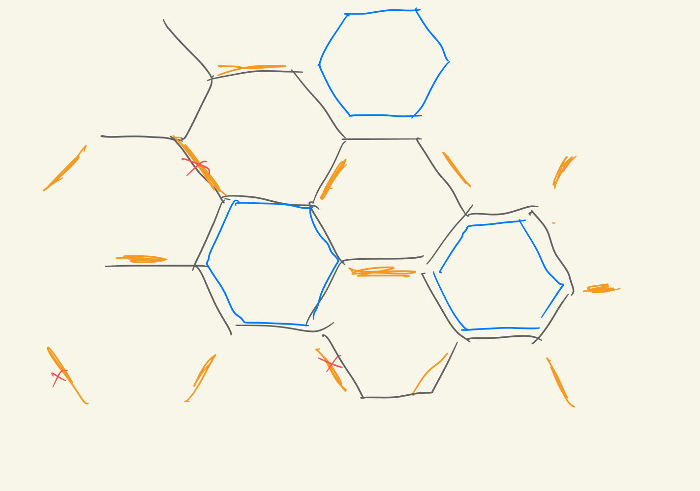
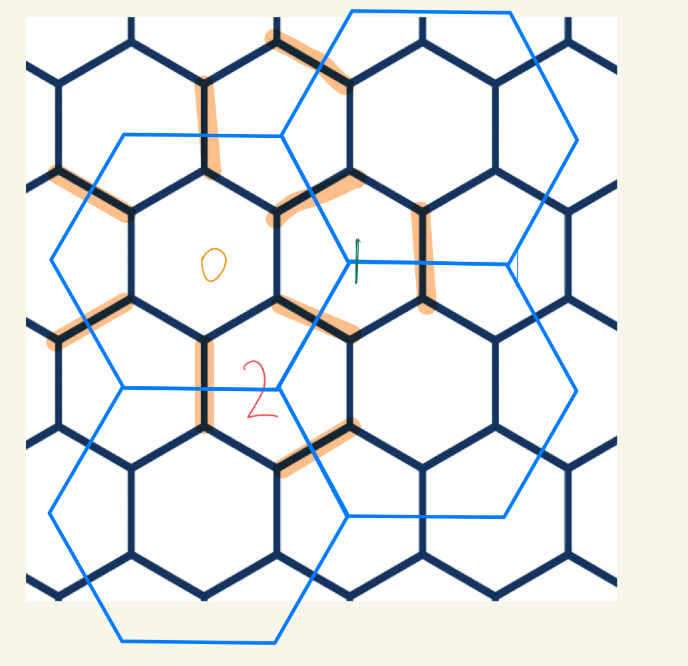
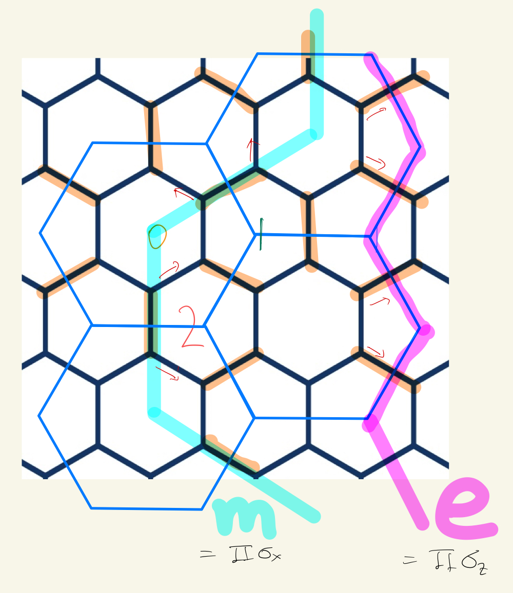
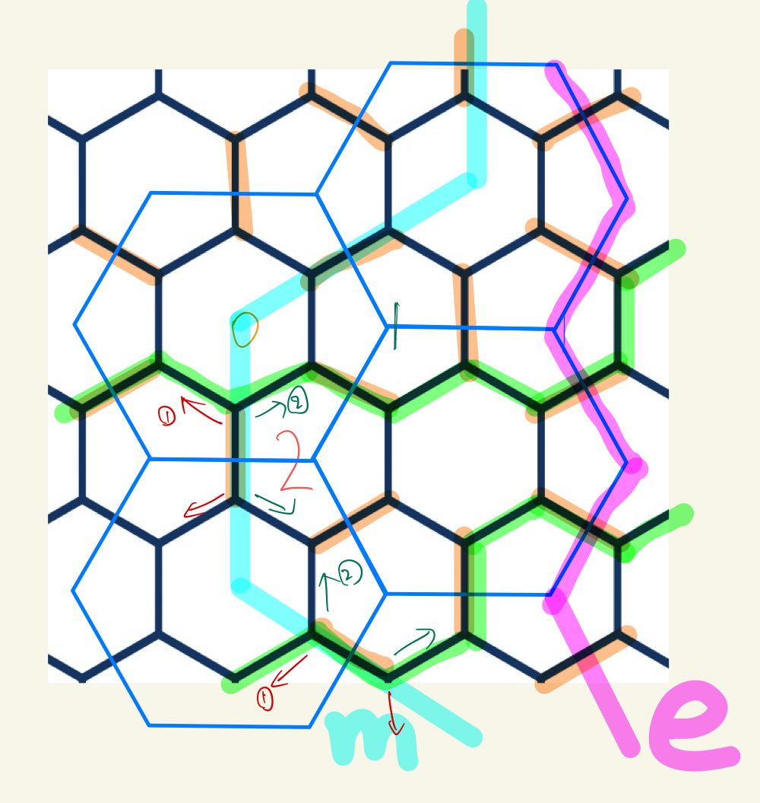
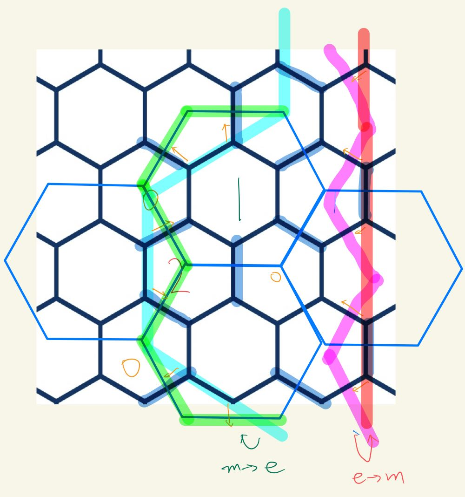
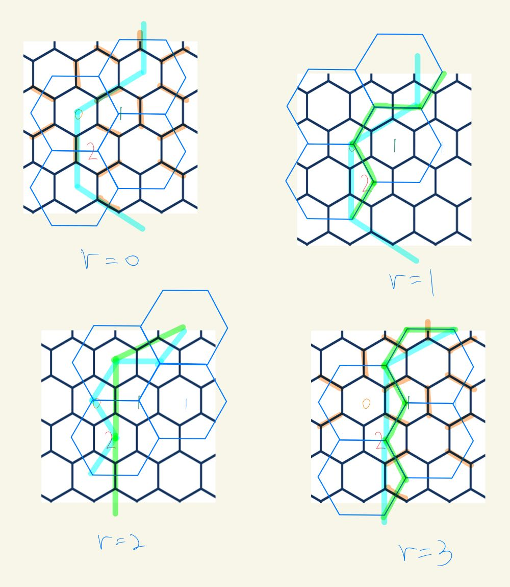
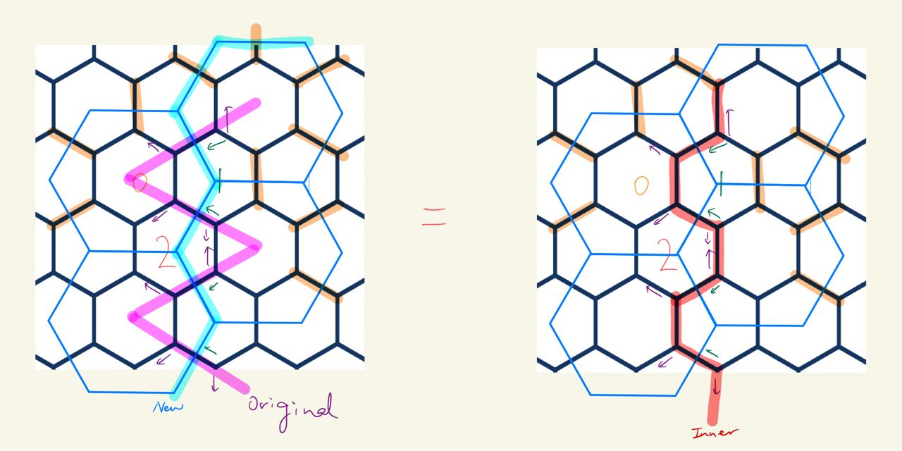
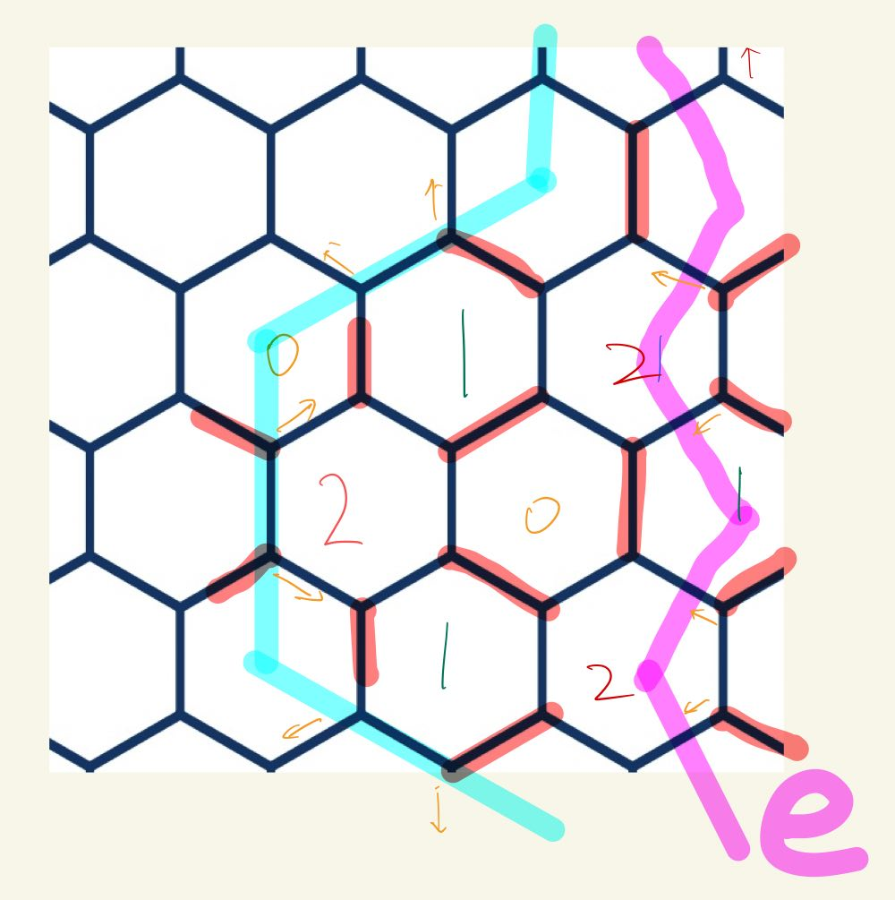

type:: paper_reading

-
- 
-
- # Questions
	- What is the role of measurement, or 'dynamical'?
		- This allows us to measure the system by products only two Pauli operators, while the stabilizers are products of six Pauli operators.
		- The key is to use rounds of **noncommuting measurements**.
		- Could we generalize the idea to toric code, quantum double or even Levin Wen?
			- Attempt. Generalize to toric code
				-
	- What is the logical space?
		- The logical spaces correspond to the eigenspaces of **logical operators**, i.e. those commuting with all checks.
		  collapsed:: true
			- This is equivalent to asking 'how can we store information in a system'.
			- For a static system, we can divide the configuration space into many subsets and use 'in a certain subset' to store information.
				- Note that since we can only determine orthogonal subspaces deterministically, we should divide the linear space into orthogonal subspaces, i.e. eigenspaces of some projection operator.
			- Here we have one more possibility, i.e. the 'dynamic'.
				- However the choice is still limited. 
				  If we choose operators that do not commute, the latter measurement outcome isn't deterministic. If we choose commuting operators, then the information becomes static again.
			- Clues may come from the logical operators.
				- Conjecture. The eigenvalues of logical operators could store information.
					- In toric code, the logical operators (nontrivial string) record 'which homotopy class is the system in'.
						- To be more precise, the eigenvectors of the Z-string are $|nontrivial\rangle + |trivial\rangle$ and $|nontrivial\rangle - |trivial\rangle$
				- Let's examine the case in the ladder code.
	- Why is the dynamic measurement possible? What specific properties are used in the process? Would it be possible on lattices of different details?
-
- # Problems and Ideas
	- ((6481474d-1298-457a-93a9-d4f1d002e7c8))
	- ((647c2943-7da7-47d3-ae4b-71f305ed51b4))
	  collapsed:: true
		- Examine some simple cases.
			- Anomalous
				- It seems that in order to have nontrivial topologies, we are forced to identify lots of vertices (due to their edges) such that the resulting lattice is quite strange.
				- _1685861854793_0.png){:height 254, :width 272}
					- Counting of quantities
						- $$V=2,F=2,E=6$$
							- Don't forget the internal edge.
						- Other quantities and relations are quite messy, since the constraints are very different from a 'well-behaved' torus.
					- This is a double torus,
					  $$g=2$$
					  but since vertices are shared by only 2 faces (rather than 3), # d.o.f. is different from our previous counting.
					- In other words, the lattice is too small.
			- Normal
				- Def. All vertices are shared by three distinct plaquettes.
				- It seems that all normal lattices must have the topology of a torus. Very interesting.
				- _1685868490406_0.png){:height 301, :width 287}
				- _1685866789730_0.png){:height 301, :width 261}
					- This is a torus, so our previous discussion was valid.
			-
	- ((647bfedc-d043-4fde-8200-ccb85c080be8))
	  collapsed:: true
		- Would the property play an important role? I guess it
			- If so, then the code isn't topological. 
			  Can we consider more colors?
			- If not, how can we extract the essential ingredient?
- # ((647bff63-18ce-4de4-8a00-160567c88608))
	- ## Setup
		- ### Lattice
		  collapsed:: true
			- The lattice is a honeycomb (but the topology isn't specified).
			- One spin on each **vertex**.
			- Proposition. With $F$ plaquettes, there are $V=2n_p \ (6/3=2)$ qubits (vertices) and $E=3n_p \ (6/2=3)$ edges.
			  collapsed:: true
				- Not completely sure.
		- ### Check Operators
		  collapsed:: true
			- Label the edges by x,y,z as shown in the picture
			  ((647c00ba-8be9-4e79-baeb-782e1c93416e))
			- For an x-edge the check is $XX$, for an y-edge the check is $YY$, for an z-edge the check is $ZZ$
		- ### Labelling of the egdes
		  id:: 647c0117-9c2c-4a6a-88a3-3d3fd5bd653f
		  collapsed:: true
			- First, color the plaquettes by 3 colors 0,1,2.
			- Label the edges by 0,1,2 by the rules that every edge with label $a$ connects two nearest plaquettes with label $a$.
				- {:height 424, :width 404}
				- Orange edges are 0, blue edges are 1, purple edges are 2/
		- ### Measurement Procedure
		  collapsed:: true
			- We measure the checks in distinct rounds, measuring first all checks labeled by 0, then by 1, then by 2, repeating, so that in the $r$-th round we measure checks labeled by $r \bmod 3$.
			- Note that every qubit participates in some check at every round.
	- ## Properties as a Subsystem Code
	  collapsed:: true
		- ### Setup
		  collapsed:: true
			- **Checks** are the $XX$, $YY$, $ZZ$ placed on the edges.
			- The **gauge group** $G$ is generated by all checks.
			- The **stabilizer group** $S$ is the center of the gauge group.
			  collapsed:: true
				- Proposition. The stabilizer group is generated by all **cycles**, i.e. boundaryless collections of edges (similar to $Z_1(X)$, but the edges are not directed).
				  collapsed:: true
					- Note that the cycles can be either contractible (a boundary) or not (for example, a loop crossing the whole torus).
					-
					- It's easy to verify that a cycle commutes with any product of checks.
					  collapsed:: true
						- The key point is Pauli operators either commute or anti-commute; any product of checks must have **even** intersections with a cycle.
					- Conversely, if some product of check $A$ commutes with any other product of check, then $A$ mustn't have 'open ends', which means it must be a cycle.
					  collapsed:: true
						- Actually it is a bit subtle. For example:
						  
						- The product of the yellow edges is also a stabilizer, but it is actually equivalent to the product of the blue edges (due to the constraint $\prod\{checks\}=\epsilon$ )
					-
		- ### Basic Facts
		  collapsed:: true
			- The dimension (number of independent generators) of the gauge group is $E-1$.
			  collapsed:: true
				- There is one check on each edge.
				- However, there's one constraint that $\prod\{checks\}=\epsilon$ (where $\epsilon=\pm 1$ and the sign depends on the lattice).
				  id:: 647c0472-2e77-4572-861d-f7d2e6989f21
			- The dimension of the stabilizer group is 
			  collapsed:: true
			  $$d_s=F-1+2g$$
			  where $g$ is the genus of the surface.
				- The generators are the plaquette operators $B_p$ ($n_p$ in total) and the nontrivial loops ($2g$ in total)
				- However there's one constraint that $\prod_p B_p = 1$.
			- Proposition. When viewed as a subsystem code, there is **no** logical qubit.
			  collapsed:: true
				- The qubits could be divided into 3 parts:
				  collapsed:: true
					- $n_l$ logical qubits
					- $n_s$ stabilizer qubits, with **one** stabilizer operator for each qubit
					- $n_g$ gauge qubits, with **two** gauge operator for each qubit
					-
				- The gauge part $L=G/S$, thus the gauge group has dimension $d_g=E-F-2g$, corresponding to 
				  $$n_g=\frac {E-F}2 -g$$
				  gauge qubits.
				- collapsed:: true
				  $$n_{phys}=N-n_g-d_s=V-\frac{E+F}2 +1-g$$
					- The expression isn't topological, thus the number of logical qubits depends on the details of the lattice!
				- For a well-behaved torus:
				  collapsed:: true
					- $$V=6F/3=2F,E=6F/2=3F, g=1$$
					- $$n_{phys}=2F-2F+(1-1)=0$$
				- Therefore there is no logical qubit.
				-
				- **Comments**
				  collapsed:: true
					- If we ignore the two incontractible loops (i.e. delete 2 stabilizers), then there'll be 2 logical qubits?
					- What if $g>1$? We cannot have a negative number of physical qubit. Something must be wrong.
					  background-color:: red
					  id:: 647c2943-7da7-47d3-ae4b-71f305ed51b4
					  collapsed:: true
						- The good news is that we only need to consider n-torus and n-projective planes (though we can in principle consider lattices that are not surfaces, which is more complicated but more unexplored)
						- Possibilities:
						- We cannot create honeycomb surfaces with $g>1$ self-consistently?
						  logseq.order-list-type:: number
						- Our counting is problematic?
						  logseq.order-list-type:: number
						- Hidden constraints for surfaces with higher genus?
						  logseq.order-list-type:: number
	- ## Instantaneous Stabilizer Groups (ISG)
	  collapsed:: true
		- Note: Though the product of 0-edges is equivalent to the product of 0-plaquettes, we are **not** measuring the product of 0-plaquettes.
		  We are measuring the **individual** checks, not their products.
		- Proposition. Evolution of ISG:
		  collapsed:: true
		  1. After round 0 (measuring 0-checks, see ((647c0117-9c2c-4a6a-88a3-3d3fd5bd653f))), the ISG $\mathcal{S}(0)$ is generated by the checks of type 0.
		  2. After round 1, the ISG $\mathcal{S}(1)$ is generated by the checks of type 1 and the plaquette stabilizers on hexagons of type 2.
		  3. After round 2, the ISG $\mathcal{S}(2)$ is generated by the checks of type 2 and the plaquette stabilizers of type 2 and type 0.
		  4. On subsequent rounds $r \geq 3$, the ISG $\mathcal{S}(r)$ is generated by checks of type $r$ mod 3 and all the plaquette stabilizers.
			- 1 is obvious.
			- 2
			  collapsed:: true
				- It's obvious that checks of type 1 are in $\mathcal S(1)$. The remaining question is that how much of $S(0)$ could survive, i.e. commute with all 1-checks.
				- Since 0-checks and 1-checks anti-commute, we need even anti-commutations. Thus the minimal unit is the product of three 0-checks on the same plaquette.
			- 3
			  collapsed:: true
				- The argument is similar to 2. 
				  2-plaquettes could survive since they commute with any checks; 0-plaquettes are generated by 2-checks and remaining 1-checks.
			- 4: Similar.
		- Proposition. There are 2 logical qubits for all rounds $r \geq 3$
			- For $r \geq 3$, there are always $n_p$ checks of type r mod 3 and $n_p$ plaquette operators.
			- There are also two constraints.
				- Product of all plaquette operators is $\mathbb 1$.
				- Product of all type-r checks is equivalent to the product of all type-r plaquette operators.
			- Therefore the dimension of the stabilizer group is $2n_p-2$ and the number of qubits (edges) is $2n_p$,
			  thus there are 2 logical qubits.
		- collapsed:: true
		  #+BEGIN_TIP
		  It's crucial that ISG never contains incontractible loops, which means there are fewer contraints.
		  On the contrary, if we measure x,y,z operators successively, there would be incontractible loops in ISG and there'll be no logical qubits!
		  #+END_TIP
			-
	- ## Logical Operators and Embedded Toric Code
	  collapsed:: true
		- ### Comments
			- An inner operator is an f-string, i.e. could be generated by outer operators (strings in the embedded code).
				- We need to combine two strings to generate an inner operator, since each string anti-commutes with some checks.
			- This also rings true in the ladder code, where the inner operator itself is precisely a string.
		- Inner operators
			- Incontractible loops on the lattice.
			- Independent of the number of round $r$. There are two on a torus.
		- ### Embedded Toric Code
		  collapsed:: true
			- {:height 417, :width 360}
			  collapsed:: true
				- The d.o.f. of the embedded toric code are on the edges, corresponding to the 2D eigenspace with eigenvalue +1 of the check ($|\uparrow \uparrow \rangle$ and $|\downarrow \downarrow \rangle$ ).
				  collapsed:: true
					- Evidently the map depends on the round $r$, since different rounds have different checks.
				- Note that $B_p= \prod_{\partial p} \sigma_z$ and $A_v=\prod_{\partial v} \sigma_x$
			- Proposition. The 0-plaquette operators are mapped to $B_p$ in the toric code while the 1- and 2- plaquette operators are mapped to $A_v$.
			  collapsed:: true
				- Note that a plaquette operator is equivalent to the product of operators on the vertices, of the type same as the edge 'reaching out'.
				- A 0-plaquette acts as a product of Pauli-Z.
				- For 1-plaquettes and 2-plaquettes, the operators on the vertices of a 0-edge are Pauli-X and Pauli-Y *in the honeycomb code*, thus the product is Pauli-Y *in the toric code*.
				-
		- Outer operators
		  collapsed:: true
			- They're the incontractible e-string and m-string operators in the embedded toric code.
			  collapsed:: true
			  {:height 326, :width 274}
				- e-string: $\prod \sigma_z$ in toric code, **half the check** on the edges in the original honeycomb.
				  collapsed:: true
					- In other words, a single vertex of the plaquette operator in TC.
				- m-string: $\prod \sigma_x$ in toric code. 
				  collapsed:: true
				  For an egde with check $a \otimes a$ In the original honeycomb, we write a two-qubit operator $a^{\prime} \otimes a^{\prime \prime}$ where $a, a^{\prime}, a^{\prime \prime}$ are all distinct.
					- For example, after round $r=0 \bmod 3$, on a type $0 X$ edge we write $Z \otimes Y$. (We could write $Y \otimes Z=(X \otimes X)(Z \otimes Y)$.
					- In other words, a single edge of the vertex operator in TC.
				- The red arrows in the picture shows the implementations of the outer operator.
			- Comments
			  collapsed:: true
				- Dependent on the round number $r$, since the embedded toric code depends on the round.
				- In this viewpoint they're manifestly homotopic invariant.
				- Note that they're not generated by checks. Otherwise they must be stabilizers or inner operators.
				  background-color:: pink
				  id:: 647d4874-c594-4fac-a8f9-7205107eeca9
				  However they must commute with all r-checks.
			- We know there are two strings and two dual strings on a torus. However, there are still two inner operators, so we have six in total! Are they all independent?
			  background-color:: red
			  collapsed:: true
				-
		- Commutation relations of inner and outer operators
			- {:height 348, :width 334}
			  collapsed:: true
				- The green lines are inner logical operators.
			- Proposition. The inner logical operators anti-commute with m-strings.
			  collapsed:: true
				- Manifest from the picture.
				- The upper inner operator: One anti-commutation with the m-string, one anti-commutation with the e-string.
				- The lower inner operator: One anti-commutation with the m-string (there must be one vertex same and one vertex different), one anti-commutation with the e-string.
		- Dynamics: Relations between outer operators at round $r$ and checks at round $r+1$
		  collapsed:: true
			- {:height 460, :width 335}
			  collapsed:: true
				- Here we draw toric code at **round 1** and e-string and m-string at **round 0**.
			- Proposition. An e-string at round 0 becomes an m-string at round 1 and vice versa (with suitable implementations).
			  collapsed:: true
				- Shown in the above picture.
				- As a corollary, the implementation commute with all 1-checks.
			- After 3 rounds, an e-string becomes a parallel m-string and vice-versa, but the difference is only an inner operator!
			  collapsed:: true
			  In other words, an inner operator is precisely an f-string.
				- {:height 782, :width 634}
				- {:height 296, :width 584}
			- Notes
			  collapsed:: true
				- However, the original implementations of the strings could not still commute with all 2-checks.
				  collapsed:: true
					- {:height 488, :width 340}
					-
				- Therefore we must **change the implementation each round** if we wish that an outer operator commutes with all checks at all rounds.
- # ((647ff96f-cdd3-4d23-bbd0-379965a6658b))
  collapsed:: true
	- ## Comments and Questions
	  collapsed:: true
		- It seems quite similar to the honeycomb code, in the sense that each vertex is connected to three different kind of checks.
		  id:: 6481474d-1298-457a-93a9-d4f1d002e7c8
		  collapsed:: true
			- Would any trivalent lattice serve?
			  id:: 648147aa-1ade-4d8c-8f60-2ddf5f0acf9c
		- The main differences: 1. Different topology; 2. Different construction of outer operators
	- ## Setup
		- ((648022ea-9867-4c55-a206-da735a81cc6e))
		  collapsed:: true
			- Vertical checks are all $ZZ$
			- Horizontal checks are alternatively $XX$ and $YY$
		- ### Measurement Pattern
			- A period includes 4 rounds.
			- Z-check -> X-check -> Z-check -> Y check
			- Claim. The reason that we don't measure Z -> X -> Y is that this measures an inner logical operator.
			  background-color:: red
			  collapsed:: true
				- This seems suspicious, since measuring the **product** of all $X$ and $Y$ is different from measuring $X$ and $Y$ successively.
	- ## Evolution of ISG
	  collapsed:: true
		- For $r \geq 4$, $S(r)$ is generated by all plaquette stabilizers plus r-checks.
		  collapsed:: true
			- First, plaquette operators can indeed be generated and commute with all checks.
			- Furthermore, the smallest unit of 'remnant of round $r-1$' is precisely a plaquette.
	- ## Logical Space, Logical Operators and the Embedded Code
		- There is always one logical qubit.
		  collapsed:: true
			- For a ladder of length $2L$ (with PBC):
			  collapsed:: true
				- $4L$ vertices
				- $2L$ r-checks
				- $2L$ plaquettes
				- Constraints
				  collapsed:: true
					- For Z-rounds: Product of all Z-checks = Product of all plaquettes
					- For X- (Y-) rounds: Product of all X- (Y-) checks = Product of all even (odd) plaquettes
					- Thus there is one constraint every round
		- Inner operator
		  collapsed:: true
			- The only topologically nontrivial loop.
		- ### Embedded Code
		  collapsed:: true
			- For Z-rounds:
				- _1686120381598_0.png){:height 150, :width 588}
				  collapsed:: true
					- One effective qubit ($|\uparrow \uparrow \rangle$ and $|\downarrow \downarrow \rangle$) each edge.
				- Both X- and Y- plaquettes act as $\prod_{\partial p} \sigma_x$ in the embedded code.
				  collapsed:: true
					- Evident for X-plaquettes.
					- For Y-plaquettes, $i^2=(-i)^2=-1$, so the action is $-X \simeq X$.
				- Obviously the nontrivial string is the $\prod \sigma_z$, which could be implemented by the product of **half the Z-checks** on the Z-edges.
			- For X- and Y- rounds:
				- _1686120746633_0.png){:height 152, :width 602}
				- The nontrivial string could be implemented by the product of X on the upper vertex on the edges intersecting with the string.
				- _1686205277314_0.png){:height 134, :width 573}
			-
		- #+BEGIN_CAUTION
		  Nontrivial strings in the embedded code coincide with the inner operators! We need another construction.
		  #+END_CAUTION
			- Why does this happen? Why do string operators in the embedded toric code (in the case of the honeycomb) anti-commute with inner operators?
			- However, outer operators can still be viewed as nontrivial vertical strings. It is just that the nontrivial horizontal strings coincide with the inner operators.
		- Outer operator
		  collapsed:: true
			- For X-rounds, it is any $XX$ on a **single** vertical rung. For Y-rounds it is $YY$.
			- For Z-rounds, any $XX$ or $YY$ on a single vertical rung serves.
	- ## Fault Tolerance
		- TODO Examine the logical space (i.e. eigenspaces of the logical operators).
			- Here is one subtlety: A given implementation of outer operators do not commute with the checks.
		- Comment
			- In each round of measuring, the outcomes of the checks are **not deterministic**.
			- However, some combinations are **deterministic**, e.g. the plaquette operators.
		- The plaquette operators are taken to be the **syndrome bits**.
		  collapsed:: true
			- Specifically:
				- In round 0 we measure Z-checks.
				- In round 1 we measure X-checks and obtain the values of X-plaquettes (combining data from round 0).
				- In round 2 we measure Z-checks again.
				- In round 3 we measure Y-checks and obtain the values of Y-plaquettes (combining data from round 2).
			- Proposition. Though the checks measured at different rounds don't commute, the syndrome bits always give the same deterministic results.
				- The plaquette operators always commute with all measurements.
				- If two operators commute, than the action of one won't change the eigenvalue of another.
		- Proposition. The code has distance 2.
			- An outer logical operator has weight 2, so the distance cannot exceed 2.
			- Any single-qubit Pauli operator would flip the values of two checks, thus flipping at least one plaquette.
				- Moreover we can correct the error (up to checks) from which plaquettes are flipped.
- # ((6481776c-90d5-4700-b5c9-7577475df226))
  collapsed:: true
	- ## Setup
		- Syndrome bits: Plaquette operators
		- After round $r$ with $r \geq 3$, we obtain values of type-(r+1) plaquettes from datas in round $r-1$ and round $r$.
			- Note that each vertex is surrounded by edges of **different types**.
	- ## Error Detection and Correction
		- In short, each error (selected from single-site Pauli matrices) causes two adjacent plaquettes to flip, depending on the error is X, Y or Z.
		- ### Dual Lattice
			- Setup
				- Triangular lattice
				- each error is an edge flipping the adjacent vertices (plaquettes in the original lattice).
			- Proposition. Any homotopic trivial error could be corrected (up to checks, which commute with the logical operators).
			-
		-