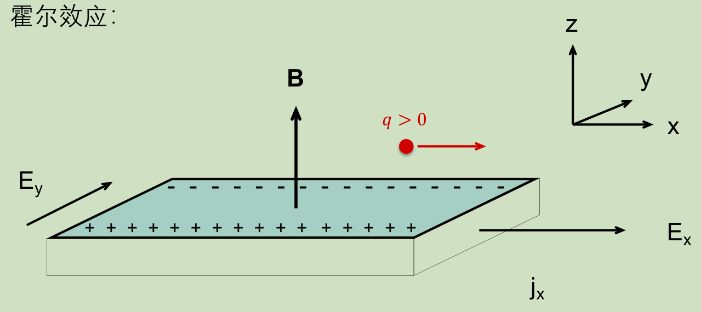
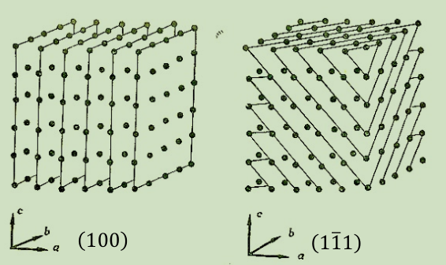
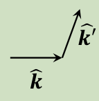
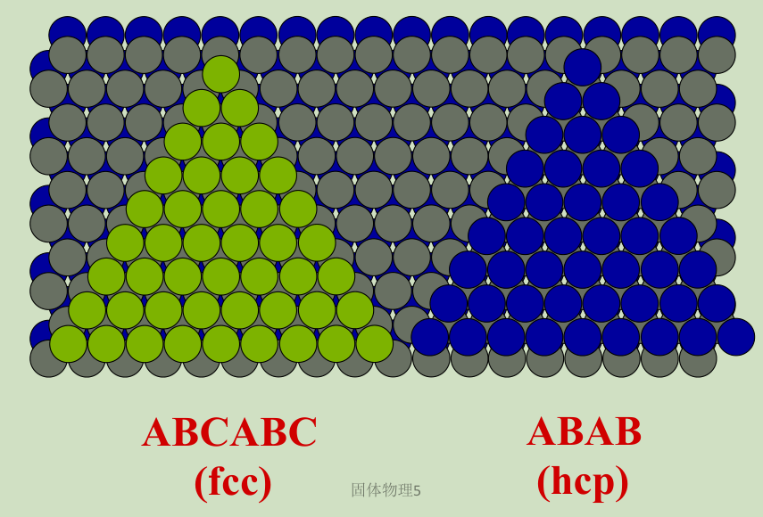
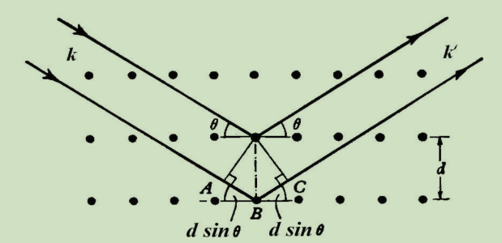

# Free Electrons
id:: 65f4fd67-9f37-484c-8080-04a14d598bc3
collapsed:: true
	- ((65503243-b09d-4b95-a43a-bc95ef69d5ac))
		- Note that to study $\omega_p$ and resonance we need to study the effective AC dielectric constant, not only the conductance!
	- Classical Hall effect under Drude Model
	  collapsed:: true
		- Setup
		  collapsed:: true
			- 
			- Without the magnetic field, there is $E_y$ but **NO CURRENT**.
		- Definition. Hall resistance
		  collapsed:: true
			- $$
			  R_H=\frac{E_y}{j_x B}
			  $$
		- Proposition.
		  collapsed:: true
		  $$
		  R_H=-\frac{1}{n e}
		  $$
			- Derivation
			  collapsed:: true
				- $$
				  \frac{d \boldsymbol{p}}{d t}=\boldsymbol{F}-\frac{\boldsymbol{p}}{\tau}=-e\left(\boldsymbol{E}+\frac{\boldsymbol{p} \times \boldsymbol{B}}{m}\right)-\frac{\boldsymbol{p}}{\tau}=0
				  $$
				- Rewritten as components,
				  collapsed:: true
				  $$
				  \begin{aligned}
				  & -e E_x-\frac{e B}{m} p_y-\frac{1}{\tau} p_x=0 \\
				  & -e E_y+\frac{e B}{m} p_x-\frac{1}{\tau} p_y=0
				  \end{aligned}
				  $$
					- Note that $E_x$ would become non-zero at equilibrium.
				- At equilibrium: $j_y=0$. Consider only the second equation above, we see that
				  collapsed:: true
				  $$
				  E_y =-\frac{1}{n e} j_x B
				  $$
					-
	- Heat transport
	  collapsed:: true
		- Wiedemann-Franz law: $\frac{\kappa}{\sigma T}$ is approximately a constant across different materials.
		  collapsed:: true
			- Classical (wrong) derivation
				- Consider a virtual boundary, with
				  $$
				  \Delta x=\left\langle v_x\right\rangle \cdot 2 \tau
				  $$
				- The net heat current flowing from the high-T side to the low-T side is
				  $$
				  j_q=\frac{1}{2} n \times \frac{3}{2} k_B\left(T_1-T_2\right) \times\left\langle |v_x|\right\rangle
				  $$
				- Ignore the difference between $\left\langle v_x^2\right\rangle$ and $\left\langle |v_x|\right\rangle^2$, we see that
				  $$
				  \kappa=\frac{1}{3} c_v\left\langle v^2\right\rangle \tau
				  $$
					- $c_v=\frac 3 2 k_B n$
				- Finally,
				  $$
				  \frac{\kappa}{\sigma T}=\frac{1}{3} c_v\left\langle v^2\right\rangle \tau \frac{m}{n e^2 \tau} \frac{1}{T}=\frac{3}{2}\left(\frac{k_B}{e}\right)^2
				  $$
				  which is **half** the real value.
				- Actually it is irreparably erroneous. We really need quantum derivations here.
	- Sommerfeld Theory
		- Notes
			- Treat electrons as free fermions, thus satisfying the Fermi-Dirac distribution.
			- Near room temperature, $T_F \gg T$, thus we could almost ignore $T$.
		- Definitions
			- Fermi temperature
				- $$
				  T_F=\frac{\epsilon_F}{k_B}
				  $$
			- Fermi velocity
				- $$
				  v_F=\frac{\hbar k_F}{m}
				  $$
			- Electron **mode** density distribution function $g(\varepsilon)$
			  $$
			  n_{mode}=\frac{N_{mode}}{V}=\int_0^{\epsilon_F} d \epsilon \cdot g(\epsilon)
			  $$
				- Independent of temperature, only the density of available electron modes!
				- Note that in 3D, 
				  $$
				  g(\varepsilon)=\frac{(2 m)^{3 / 2}}{2 \pi^2 \hbar^3} \epsilon^{1 / 2}
				  $$
			- Bohr radius
			  $$
			  a_0=\hbar^2 / m e^2=0.529 \times 10^{-8} \mathrm{~cm}
			  $$
		- Proposition. 
		  collapsed:: true
		  $$
		  k_F=\left(\frac{9 \pi}{4}\right)^{1 / 3} \frac{1}{r_s}
		  $$
		  where $r_s$ is the effective distance between electrons.
			- Consider a material with the shape of a cube.
			- Step 1. Eigenstates and number of particles
				- Each eigenstate takes volume $\left(\frac{2 \pi}{L}\right)^3$ in momentum space.
				- Therefore, the total number of particles is 
				  $$N=2 \times (\frac {2\pi} L)^{-3} \frac 4 3 \pi k_F^3=\frac{V k_F^3}{3 \pi^2}$$
					- The first 2 accounts for the spin.
			- Step 2. Compare to the effective distance
			  $$
			  n=\frac{N}{V}=\frac{k_F^3}{3 \pi^2}=\left(\frac{4 \pi}{3} r_s^3\right)^{-1}
			  $$
			- Thus we directly obtain the result.
		- Proposition. The average energy at zero temperature is
		  collapsed:: true
		  $$
		  \frac{E}{N}=\frac{3}{5} \frac{\hbar^2 k_F^2}{2 m}=\frac{3}{5} \epsilon_F
		  $$
			- Essentially
			  $$(\int_0^1 r^2 dr) \big / (\int_0^1 r^4 dr)$$
			-
		- The Sommerfeld expansion
			- Statement. At low temperature,
			  $$
			  \int_{-\infty}^{\infty} \frac{H(\varepsilon)}{e^{\beta(\varepsilon-\mu)}+1} \mathrm{~d} \varepsilon=\int_{-\infty}^\mu H(\varepsilon) \mathrm{d} \varepsilon+\frac{\pi^2}{6}\left(\frac{1}{\beta}\right)^2 H^{\prime}(\mu)+O\left(\frac{1}{\beta \mu}\right)^4
			  $$
			- Key idea
				- For $f(\varepsilon)=(e^{\beta(\varepsilon-\mu)}+1)^{-1}$, $df/d\varepsilon$ has a **strong** peak near $\varepsilon=\mu$.
				- Thus we can first perform integration by part, then perform Taylor expansion at $\mu$.
		- Specific heat
			- Use the Sommerfeld expansion, we find
			-
		- Re-examine the Wiedemann-Franz law
		  collapsed:: true
			- Use $c_v=\frac{\pi^2}{2}\left(\frac{k_B T}{\varepsilon_F}\right) n k_B$ and use $v_F$ instead of $v_0$
			- We obtain $2.44 \times 10^{-8} \mathrm{~W} \Omega / \mathrm{K}^2$, much closer to experiment.
		- Re-examine the Seeback effect
		  collapsed:: true
			- $$
			  v_Q+v_E=0 \Rightarrow Q=-\left(\frac{1}{3 e}\right) \frac{d}{d T}\left(\frac{m v^2}{2}\right)=-\frac{c_v}{3 n e}
			  $$
			- Similarly, use $c_v$ of fermions to obtain
			  $$
			  Q=-\frac{\pi^2}{6} \frac{k_B}{e}\left(\frac{k_B T}{\epsilon_F}\right)
			  $$
		-
- # Lattice Structures
	- Definitions
		- Primitive cell
			- A volume, which could fill the whole space without overlapping under the action of the translation group
			- Not unique!
			  background-color:: yellow
		- Unit cell
			- A volume, which could fill the whole space without overlapping under the action of **a subgroup of** translation group
		- Wigner-Seitz cell
			- A unit cell, formed by the set of spatial points closer to a particular lattice point than any other
		- 晶列
			- 一条无穷多个格点构成的直线
			- 晶列的方向称为晶向
		- 晶向指数
		  collapsed:: true
			- 取晶格中任一格点为原点 $O$，沿某一晶向到最近邻格点 $A$ 的平移矢量:
			  $$
			  O A=l_1 a_1+l_2 a_2+l_3 a_3
			  $$
			  则 $\left[l_1 l_2 l_3\right]$ 即为 $\mathrm{OA}$ 的晶向指数, 遇到负数, 将负号记在数的上边。
			- 
		- 晶面
		  collapsed:: true
			- 一族平行平面，使得任意格点都在一个平面上
			- {:height 270, :width 396}
		- 晶面指数
		  collapsed:: true
			- 是一种用来确定晶体方向的指数。要想计算出一个晶面的密勒指数 $(h k)$ 需要:
			  1. 确定该晶面在晶胞坐标轴上的截距(依序为 $x, y, z$ 轴，通常为长、宽、高)
			  2. 取这些值的**倒数** (默认 $\infty$ 的倒数为 0 )
			  3. 将这些倒数化作最简整数比
			  4. 用括号将它们括起
			- 
		- Coordination number 配位数
		  collapsed:: true
			- The number of closest lattice points
			- The simple cubic: 6
			- The body-centered cubic: 8
			- The face-centered cubic: 12
		- Packing density
			- The proportion of the space filled by the figure
		-
		- Reciprocal lattice 倒格子
		  collapsed:: true
			- L'ensemble des vecteur $\vec K$ tel que
			  $$
			  e^{i \vec{K} \cdot \vec{R}}=1
			  $$
			  pour tous les positions $\vec R$ du réseau de Bravais.
			- To calculate a basis of the reciprocal lattice, we could first select a direction perpendicular to two lattice vectors:
			  $$
			  \begin{aligned}
			  & b_1=2 \pi \frac{a_2 \times a_3}{a_1 \cdot\left(a_2 \times a_3\right)}=\frac{2 \pi}{\Omega} a_2 \times a_3 \\
			  & b_2=2 \pi \frac{a_3 \times a_1}{a_1 \cdot\left(a_2 \times a_3\right)}=\frac{2 \pi}{\Omega} a_3 \times a_1 \\
			  & b_3=2 \pi \frac{a_1 \times a_2}{\boldsymbol{a}_1 \cdot\left(a_2 \times a_3\right)}=\frac{2 \pi}{\Omega} a_1 \times a_2
			  \end{aligned}
			  $$
			- Proposition. Taking the reciprocal of the reciprocal is identity.
		- Brillouin zone
			- La maille de Wigner-Seitz dans des l'espace réciproque.
		- 对称素
		  collapsed:: true
			- Def. 标记对称操作的集合对象
			- n次旋转轴
			- 反演中心
			- n次旋转反演轴
		-
		- 原子形状因子
			- $$
			  f_j\left(\boldsymbol{G}_h\right) \equiv \int_{\text {cell }} n_j(\boldsymbol{r}) e^{-i \boldsymbol{G}_h \cdot \boldsymbol{r}} d \boldsymbol{r}
			  $$
				- Take the atom to be of finite size. $n_j$ is the particle (electron) density of the $j$th atom in the unit cell.
				- $\mathbf G_h:= \mathbf k-\mathbf k'$
				- 
				-
		- 几何结构因子
			- $$
			  S_{\boldsymbol{G}_h} \equiv \sum_{j=1}^p f_j\left(\boldsymbol{G}_h\right) e^{-i \boldsymbol{G}_h \cdot \boldsymbol{d}_j}
			  $$
			- Sum over $p$ particles in the unit cell
	- ## Cubics
		- Simple cubic
		  collapsed:: true
			- 
			- 1 atom per cell
			- Max packing density: $\pi / 6$
			- Lattice vectors
				- $$
				  \begin{aligned}
				  &\begin{aligned}
				  & \boldsymbol{a}_1=(1,0,0) a \\
				  & \boldsymbol{a}_2=(0,1,0) a \\
				  & \boldsymbol{a}_3=(0,0,1) a
				  \end{aligned}\\
				  &\boldsymbol{R}_1=(0,0,0)
				  \end{aligned}
				  $$
			- Examples
				- Sodium chloride
					- 
		- Body-centered cubic
			- 
			- 2 atoms per cell
			- Max packing density: $\sqrt 3 \pi / 8$
			- $$
			  \begin{aligned}
			  & \boldsymbol{a}_1=(-1,1,1) \frac{a}{2} \\
			  & \boldsymbol{a}_2=(1,-1,1) \frac{a}{2} \\
			  & \boldsymbol{a}_3=(1,1,-1) \frac{a}{2} \\
			  & \boldsymbol{R}_1=(0,0,0)
			  \end{aligned}
			  $$
			- Example
				- Cesium chloride
					- $$
					  \boldsymbol{R}_1=(0,0,0) \quad \text { --- atom A }  \\
					  \boldsymbol{R}_2=(1,1,1) \frac{a}{2} \quad \text { --- atom B }  \\
					  \boldsymbol{a}_1=(1,0,0) a \\
					  \boldsymbol{a}_3=(0,0,1) a \\
					  \boldsymbol{a}_2=(0,1,0) a
					  $$
					-
		- Face-centered cubic
			- 
			- 4 atoms per cell
			- Max packing density: ${\sqrt{2} \pi}/{6}$
			- Lattice vectors
			  collapsed:: true
				- $$
				  \begin{aligned}
				  & \boldsymbol{a}_1=(0,1,1) \frac{a}{2} \\
				  & \boldsymbol{a}_2=(1,0,1) \frac{a}{2} \\
				  & \boldsymbol{a}_3=(1,1,0) \frac{a}{2} \\
				  & \boldsymbol{R}_1=(0,0,0)
				  \end{aligned}
				  $$
			- Examples
			  collapsed:: true
				- Diamond: All atoms are the same
					- 
					  id:: 660fac93-ab1b-4927-9620-33f3755fa08d
					- $$
					  \begin{aligned}
					  & \boldsymbol{a}_1=(0,1,1) \frac{a}{2} \\
					  & \boldsymbol{a}_2=(1,0,1) \frac{a}{2} \\
					  & \boldsymbol{a}_3=(1,1,0) \frac{a}{2} \\
					  & \boldsymbol{R}_1=(0,0,0) \\
					  & \boldsymbol{R}_2=(1,1,1) \frac{a}{4}
					  \end{aligned}
					  $$
				- Zincblende: Two different atoms
					- 
					- $$
					  \begin{aligned}
					  & \boldsymbol{a}_1=(0,1,1) \frac{a}{2} \\
					  & \boldsymbol{a}_2=(1,0,1) \frac{a}{2} \\
					  & \boldsymbol{a}_3=(1,1,0) \frac{a}{2} \\
					  & \boldsymbol{R}_1=(0,0,0) \quad \text {--- atom A } \\
					  & \boldsymbol{R}_2=(1,1,1) \frac{a}{4} \quad \text {--- atom B }
					  \end{aligned}
					  $$
					-
			- Closed-packed structures
				- ABC and ABA
					- Note that I can deduce they are fcc by calculating the packing density.
					- {:height 372, :width 541}
					- {:height 452, :width 557}
					-
				-
			-
	- ## Symmetries
	  collapsed:: true
		- Theorem. Rotation axes could only be 2,3,4,6 fold.
			- 
			- From the picture, we easily see that
			  $$
			  2 a \cos \theta=2 a \cos \frac{2 \pi}{n}=m a
			  $$
		- Theorem. Allowed rotation-reflection axes could only be 2,3,4,6 fold.
		- Theorem. Not all rotations and rotation-reflections are independent; $\bar 3 = 3 \circ i, \bar 6 = 3 \circ m$.
		- Theorem (Neumann). All macroscopic properties of a lattice must have all the point-group symmetries.
			- Example. Rank-2 tensors: conductance tensor, dielectric tensor, etc.
				- 'Symmetry' means that
				  $$
				  \boldsymbol{A} \boldsymbol{T} \boldsymbol{A}^T=\boldsymbol{T}
				  $$
				-
	- ## Classification of Crystals
		- 7 crystal systems -> 14 Bravais lattices
		  collapsed:: true
			- 
			-
	- ## Diffraction
		- Bragg's condition:
		  collapsed:: true
		  $$
		  2 d \sin \theta=n \lambda
		  $$
			- {:height 265, :width 500}
		- Quantitative computation
			- $$
			  \begin{aligned}
			  A\left(\boldsymbol{G}_h\right) & =N c \int_{\text {cell }} \sum_{j=1}^p n_j(\boldsymbol{\eta}) e^{-i \boldsymbol{G}_h \cdot\left(\boldsymbol{\eta}+\boldsymbol{d}_j\right)} d \boldsymbol{\eta} \\
			  & =N c \sum_{j=1}^p e^{-i \boldsymbol{G}_h \cdot \boldsymbol{d}_j} \int_{\text {cell }} n_j(\boldsymbol{\eta}) e^{-i \boldsymbol{G}_h \cdot \boldsymbol{\eta}} d \boldsymbol{\eta}
			  \end{aligned}
			  $$
			- 消光条件: $F(K_h)=0$
			- 在实际应用中, 总是将 $\boldsymbol{r}_i$ 和 $\boldsymbol{K}_h$ 利用正点阵和倒点阵的基矢表示为
			  $$
			  \begin{aligned}
			  & \boldsymbol{r}_i=x_{i 1} \boldsymbol{a}_1+x_{i 2} \boldsymbol{a}_2+x_{i 3} \boldsymbol{a}_3 \\
			  & \boldsymbol{K}_h=h_1 \boldsymbol{b}_1+h_2 \boldsymbol{b}_2+h_3 \boldsymbol{b}_3
			  \end{aligned}
			  $$
			- 几何结构因子最后可以写为
			  $$
			  F\left(\boldsymbol{K}_h\right)=\sum_i f_i\left(\boldsymbol{K}_h\right) \mathrm{e}^{-2 \pi \mathrm{i}\left(h_1 x_{i 1}+h_2 x_{i 2}+h_3 x_{i 3}\right)}
			  $$
		- Experimental methods
		  collapsed:: true
			- Laue's method: Fix the direction and vary the wavelength
			- Rotating-lattice method: Fix the wavelength and rotate the lattice to vary direction
			- Powder method: The direction is **random**
				- Random means that the direction is uniformly distributed.
				- Therefore, we can obtain lots of information about $d$ by vary the wavelength.