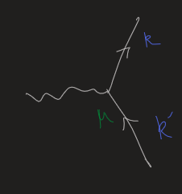

-
- We want to renormalize the photon propagators.
- # Photon [[1PI]] diagrams and general analysis of them
	- Summary #card
	  card-last-interval:: 24
	  card-repeats:: 2
	  card-ease-factor:: 2.7
	  card-next-schedule:: 2023-04-14T05:38:58.013Z
	  card-last-reviewed:: 2023-03-21T05:38:58.014Z
	  card-last-score:: 5
		- Only possible quantities are
			- $g^{\mu \nu}$ and $q^\mu q^\nu$
		- Ward identity to determine the combination
		- Effect on the photon propagator and electron charge
			- Geometric series
			- Charge renormalization
	- ((63915c6e-59ea-4795-9de9-910021452333))
	- ((63919292-0de7-4a19-b8ff-99982259edc3))
	- Which quantities may appear in the tensor indices?
		- Only $g^{\mu \nu}$ and $q^\mu q^\nu$
	- Use [[Ward-Takahashi Identity]]
		- The combination can only be proportional to $\left(g^{\mu \nu}-q^\mu q^\nu / q^2\right)$.
		- The rest of $\Pi$ must be scalar factors.
	- $\Pi^{\mu \nu}(q)=\left(q^2 g^{\mu \nu}-q^\mu q^\nu\right) \Pi\left(q^2\right)$
	- Proposition. $\Delta_\nu^\rho \equiv \delta_\nu^\rho-q^\rho q_\nu / q^2$ is a projector.
	  collapsed:: true
		- Use the fact that P is a projector to simplify. More generally, use the eigenstructures of operators. #Trick
		- Thus we may rearrange $\Pi^{\mu \nu}(q)=\Delta_\nu^\rho\ q^2\ \Pi\left(q^2\right)$
	- Thus
	   $$\text{Renormalized propagator}=\frac{-i g_{\mu \nu}}{q^2}+\frac{-i g_{\mu \rho}}{q^2}\left(\delta_\nu^\rho-\frac{q^\rho q_\nu}{q^2}\right)\left(\Pi\left(q^2\right)+\Pi^2\left(q^2\right)+\cdots\right)\\=\frac{-i g_{\mu \nu}}{q^2\left(1-\Pi\left(q^2\right)\right)}+\text{Terms proportional to }q^\mu q^\nu$$
	- Note that the terms proportional to $q^\mu q^\nu$ vanish when connected to electron lines.
	  collapsed:: true
		- We have ${q^\mu q^v}\ \bar{u}\left(k^{\prime}\right) \gamma_\nu u(k)$ for things like
		  
		- Note that $q=k'-k$, thus $\bar{u}\left(p^{\prime}\right) q u(p)=\bar{u}\left(p^{\prime}\right)\left(p-p^{\prime}\right) u(p)=0$
	-
	- Conclusion. ((63919493-53e0-4220-8289-5db5f6f8d527))
		- $\frac{1}{1-\Pi(0)} \equiv Z_3$
	-
	- Effect on the charge
		- Since there is only one kind of vertex in QED, photon propagators can only be connected like ((639194f7-ab29-4642-880a-6685beb7d55b))
			- $\cdots \frac{e^2 g_{\mu \nu}}{q^2} \cdots \longrightarrow \cdots \frac{Z_3 e^2 g_{\mu \nu}}{q^2} \cdots$
		- $$e_{phys}=\sqrt{Z_3}e_0$$
	-
- Another effect of $\Pi(q^2)$ for larger $q^2$
  background-color:: red
  collapsed:: true
	- ((6391954e-762e-4b68-bcd6-2f0acdfa4f50))
		- Is it only a technique of [[Regularization]]?
	- $\alpha_0 \rightarrow \alpha_{\mathrm{eff}}\left(q^2\right)=\frac{e_0^2 / 4 \pi}{1-\Pi\left(q^2\right)} \underset{\mathcal{O}(\alpha)}{=} \frac{\alpha}{1-\left[\Pi_2\left(q^2\right)-\Pi_2(0)\right]}$
		- The 'constants' actually shift with energy!
- # Compute $\Pi(q^2)$
  collapsed:: true
	- Summary
		- Use Feynman parameter, complete the square and Wick rotation to encounter divergence
		  collapsed:: true
			- ((63957182-d562-4ef6-9ec6-553f171f9c1c))
			- ((639571b6-7dbd-407c-8f8a-2de144854375))
			- ((639571c1-6739-49fa-814c-0f357745e477)). If we naively introduce a cutoff at $\ell = \Lambda$, Ward identity would be broken.
			- Reason: ((6395721b-ba69-421c-b91e-9d93abdc64cd)).
		- Use dimensional regularization to deal with the divergence.
	- ## Solution: [[Dimensional Regularization]]
		- ((639572cb-574a-4725-8bb3-57fdb7d64200))
		-
		- Example
			- ((63957331-144d-4f77-adc7-7d665b460576))
				- Solid angle part
					- $\int d \Omega_d=\frac{2 \pi^{d / 2}}{\Gamma(d / 2)}$
				- Radius part
					- [[Beta Function]]
						- $\int_0^1 d x x^{\alpha-1}(1-x)^{\beta-1}=B(\alpha, \beta)=\frac{\Gamma(\alpha) \Gamma(\beta)}{\Gamma(\alpha+\beta)}$
				- $$
				  \int \frac{d^d \ell_E}{(2 \pi)^d} \frac{1}{\left(\ell_E^2+\Delta\right)^2}=\frac{1}{(4 \pi)^{d / 2}} \frac{\Gamma\left(2-\frac{d}{2}\right)}{\Gamma(2)}\left(\frac{1}{\Delta}\right)^{2-\frac{d}{2}}
				  $$
					- ((639573b3-4802-47de-9e2c-5c491d2b2b78))
					- Expand to series wrt $1/\epsilon$
						- $\Gamma\left(2-\frac{d}{2}\right)=\Gamma(\epsilon / 2)=\frac{2}{\epsilon}-\gamma+\mathcal{O}(\epsilon)$
							- $\gamma \approx .5772$
				- $$
				  \int \frac{d^d \ell_E}{(2 \pi)^d} \frac{1}{\left(\ell_E^2+\Delta\right)^2} \underset{d \rightarrow 4}{\longrightarrow} \frac{1}{(4 \pi)^2}\left(\frac{2}{\epsilon}-\log \Delta-\gamma+\log (4 \pi)+\mathcal{O}(\epsilon)\right)
				  $$
					- Why do the log term pop up? #card
					  card-last-interval:: 30
					  card-repeats:: 2
					  card-ease-factor:: 2.7
					  card-next-schedule:: 2023-05-13T11:37:45.131Z
					  card-last-reviewed:: 2023-04-13T11:37:45.132Z
					  card-last-score:: 5
						- $$
						  \log \left[\left(\frac{1}{\Delta}\right)^{\varepsilon / 2}\right]=\varepsilon / 2 \log \left(\frac{1}{\Delta}\right) \\ e^{\log \left(\frac{1}{\Delta}\right)^{\varepsilon / 2}}=e^{\varepsilon /2 {\log} \frac{1}{\Delta}}=1+\frac{\varepsilon}{2} \log \frac{1}{\Delta}
						  $$
						- When $\frac 2 \epsilon$ is present, we must expand everything else to order $\epsilon$. #Tricky
					- Now invoke [[Pauli-Villars Regularization]] again. Constants and divergent logs both vanish.
		- Note that some **properties of the gamma matrices are also  dimension-dependent**, because $g_{\mu\nu}$ depends on the dimension.
		  We can nevertheless ignore them because such terms cancel when these diagrams are combined to compute an observable quantity.
	- ## Continue to compute the lowest-order correction
		- ((63957564-2bfe-4b1f-8004-d6e3f8c78406))
			- ((63957569-f8a9-4cf9-bfa1-4734afc52acc)) #Learning-TODO
		- $$
		  \begin{aligned}
		  \Pi_2\left(q^2\right) & =\frac{-8 e^2}{(4 \pi)^{d / 2}} \int_0^1 d x x(1-x) \frac{\Gamma\left(2-\frac{d}{2}\right)}{\Delta^{2-d / 2}} \\
		  & \underset{d \rightarrow 4}{\rightarrow}-\frac{2 \alpha}{\pi} \int_0^1 d x x(1-x)\left(\frac{2}{\epsilon}-\log \Delta-\gamma+\log (4 \pi)\right) \quad(\epsilon=4-d) .
		  \end{aligned}
		  $$
		- Shift of charge is $\frac{e^2-e_0^2}{e_0^2}=\delta Z_3 \underset{\mathcal{O}(\alpha)}{=} \Pi_2(0) \approx-\frac{2 \alpha}{3 \pi \epsilon}$
			- This is infinitely large, but not observable.
		- Observable: 
		  $$\widehat{\Pi}_2\left(q^2\right) \equiv \Pi_2\left(q^2\right)-\Pi_2(0)=-\frac{2 \alpha}{\pi} \int d x \ x(1-x) \log \left(\frac{m^2}{m^2-x(1-x) q^2}\right)$$
			- Independent of $\epsilon$!
	- Physical interpretations of the result
	  collapsed:: true
		- Branch cut
			- When $m^2-x(1-x) q^2<0$, the thing in log is negative.
				- The branch cut begins to appear at $q^2=4 m^2$, just ((6395783c-816e-4d2c-a10c-8cd389b1526c))
		- Corrections to the Columb potential
		  collapsed:: true
			- ((63957900-d7bc-4c25-9af4-67d5fa11a981))
			  collapsed:: true
				- Obtained by calculating scattering
				- For $\left|q^2\right| \ll m^2$, 
				  $$V(\mathbf{x})=-\frac{\alpha}{r}-\frac{4 \alpha^2}{15 m^2} \delta^{(3)}(\mathbf{x})$$
				- **EM force is much stronger at small distances than it seems!** #card
				  card-last-interval:: 24
				  card-repeats:: 2
				  card-ease-factor:: 2.7
				  card-next-schedule:: 2023-03-11T01:52:15.760Z
				  card-last-reviewed:: 2023-02-15T01:52:15.761Z
				  card-last-score:: 5
					- This is a reminder card: Macroscopic neatness and elegance may be destroyed when we examine it more closely.
					- However, this doesn't mean that physics is ugly. It just means we need a new description.
						- If we expand the corrections of QM to the leading order, it is also ugly...
				- More accurately, 
				  $$
				  V(r)=-\frac{\alpha}{r}\left(1+\frac{\alpha}{4 \sqrt{\pi}} \frac{e^{-2 m r}}{(m r)^{3 / 2}}+\cdots\right)
				  $$
			- Interpretation
				- At $r \gtrsim 1 / m$, virtual $e^{+} e^{-}$pairs make the vacuum a dielectric medium in which the apparent charge is less than the true charge.
				- At smaller distances we begin to penetrate the polarization cloud and see the bare charge.
		- Corrections to the [[Fine-structure Constant]]
			- $$
			  \alpha_{\text {eff }}\left(\frac{-q^2}{m^2}\right)=\frac{\alpha}{1-\frac{\alpha}{3 \pi}\left[\ln \frac{-q^2}{m^2}-\frac{5}{3}+\mathcal{O}\left(\frac{m^2}{-q^2}\right)\right]}
			  $$
			  for $-q^2>>m^2$
			- $\beta$-function
				- $$
				  \beta(\alpha) \equiv \frac{d \alpha}{d \ln (\mu)}=\mu \frac{d \alpha}{d \mu}
				  $$
				- $$
				  \beta(\alpha)=\frac{2 \alpha^2}{3 \pi}
				  $$
-