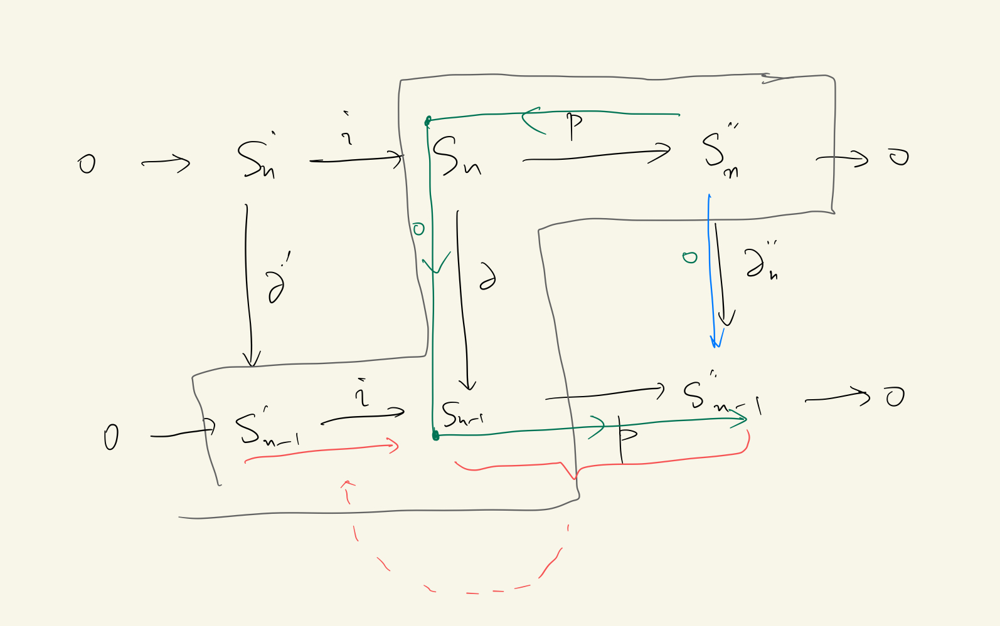
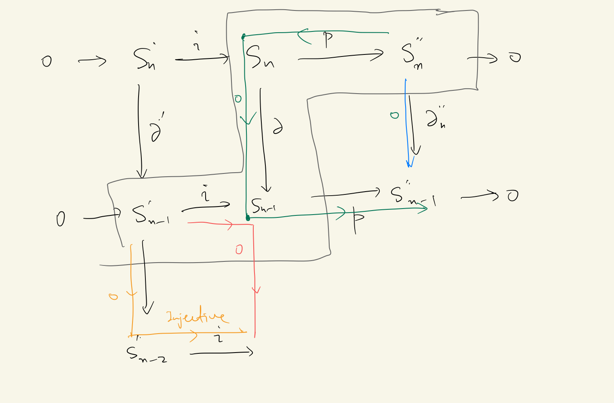
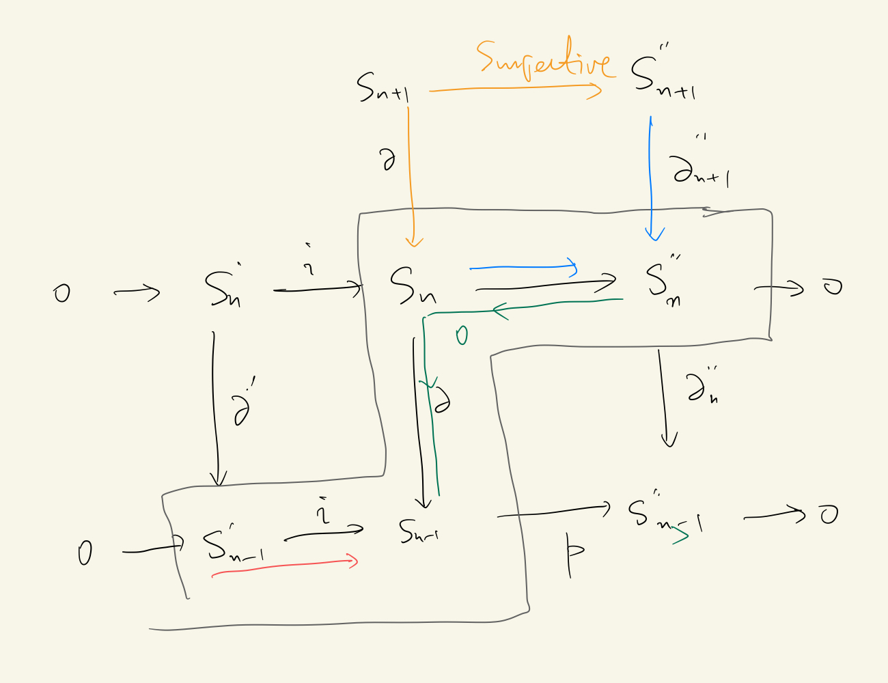
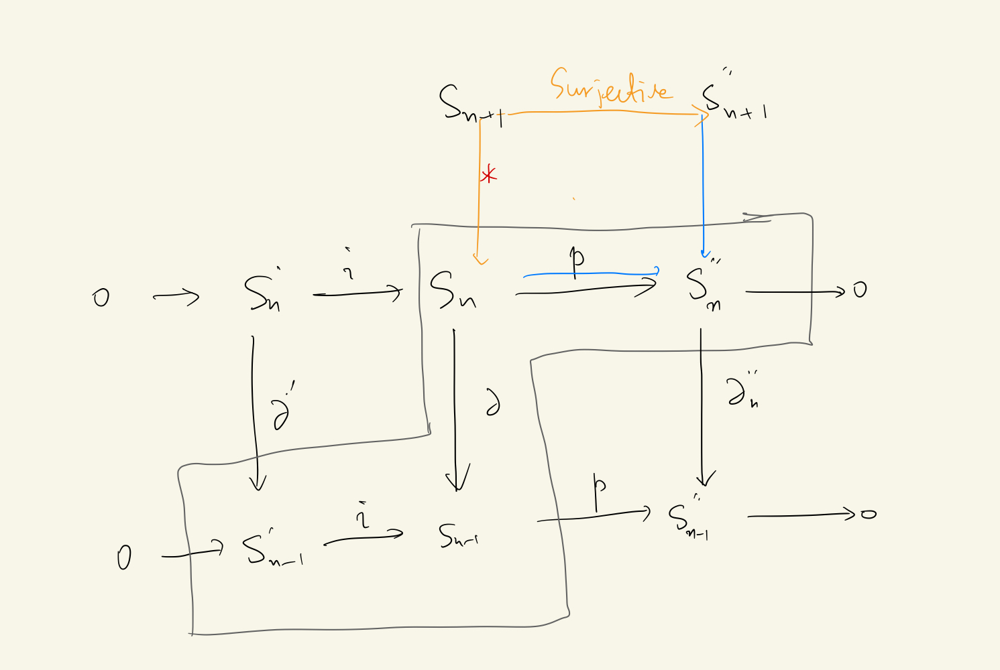
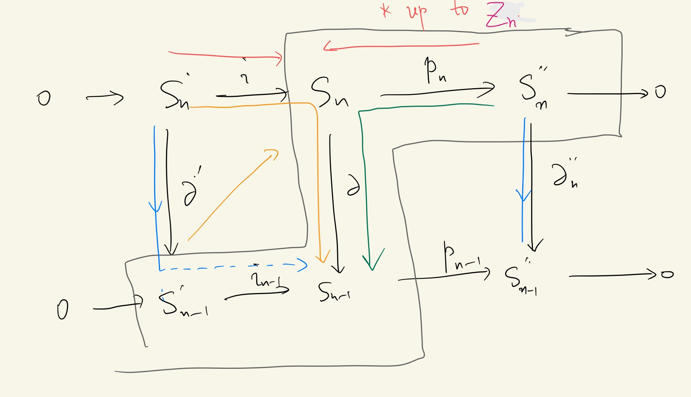
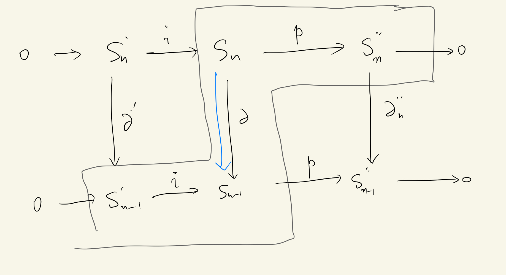
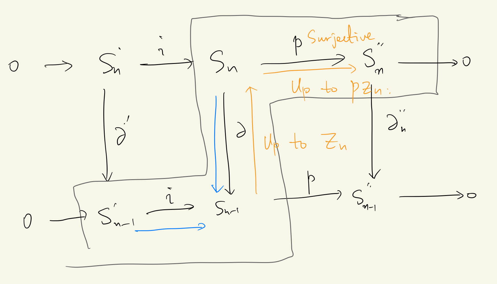
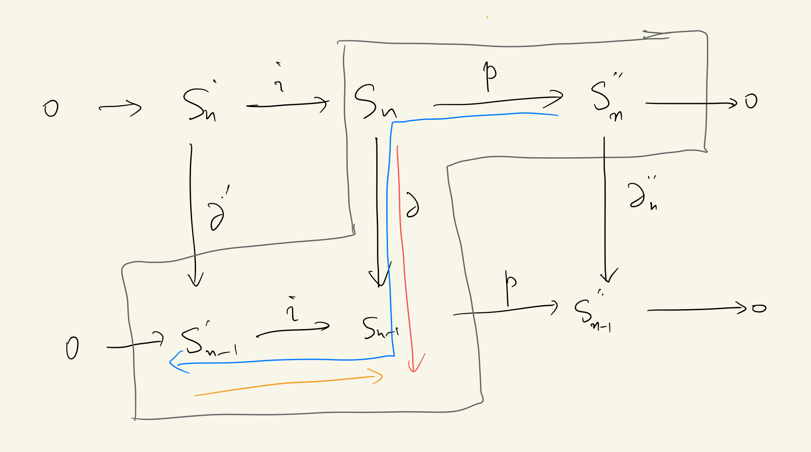
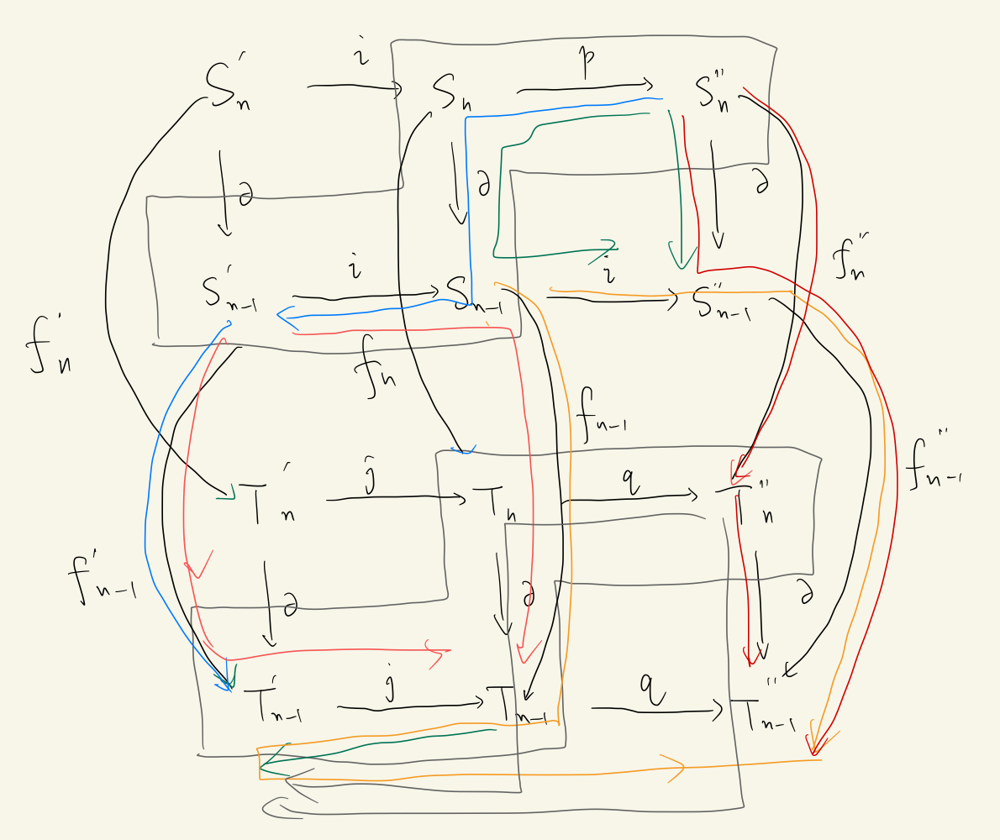

- #+BEGIN_NOTE
  Exact sequences put very strong constraints on the maps, thus we usually need not know the details of how the maps act, but only need the groups at each point.
  See ((649b9cbd-4a34-42d6-bcc4-97f1a0f91445)) for example.
  #+END_NOTE #card
- # Basics about complexes
	- ## Definitions
		- Chain complex
		  card-last-interval:: 42
		  card-repeats:: 2
		  card-ease-factor:: 2.7
		  card-next-schedule:: 2023-12-03T00:34:20.158Z
		  card-last-reviewed:: 2023-10-22T00:34:20.158Z
		  card-last-score:: 5
		  collapsed:: true
			- A (chain) complex $(S_*,\partial)$ is a sequence of **abelian** groups and homomorphisms
			  collapsed:: true
			  $$
			  \cdots \longrightarrow S_{n+1} \stackrel{\partial_{n+1}}{\longrightarrow} S_n \stackrel{\partial_n}{\longrightarrow} S_{n-1} \longrightarrow \cdots, \quad n \in \mathbf{Z},
			  $$
			  such that $\partial_n \partial_{n+1}=0$ for each $n \in \mathbf{Z}$.
				- The subscripts could be negative!
			- The homomorphism $\partial_n$ is called the **differentiation** of degree $n$, and $S_n$ is called the **term** of degree $n$.
			- $\operatorname{ker} \partial_n$ is called **the group of n-cycles** and is denoted by $Z_n\left(S_*, \partial\right)$; $\operatorname{im}\partial_{n+1}$ is called the group of **n-boundaries** and is denoted by $B_n\left(S_*, \partial\right)$. 
			  The $n$th **homology group** of this complex is
			  $$
			  H_n\left(S_*, \partial\right)=Z_n\left(S_*, \partial\right) / B_n\left(S_*, \partial\right)
			  $$
			- Note that a ((6454f1b7-f979-485a-aafb-fa39fd34e0af)) is a chain complex, with all negative terms being trivial.
			- #+BEGIN_CAUTION
			  It's as if the spirit of homology (of topological spaces) is extracted and released into a larger universe...
			  But why the spirit is a sequence of abelian groups? Not singular chains?
			  Furthermore, how to **observe** what is the spirit of a theory?
			  #+END_CAUTION
		- Exactness of a sequence of complexes
		  card-last-interval:: 31.26
		  card-repeats:: 1
		  card-ease-factor:: 2.6
		  card-next-schedule:: 2023-08-29T18:28:35.217Z
		  card-last-reviewed:: 2023-07-29T12:28:35.217Z
		  card-last-score:: 5
		  collapsed:: true
			- A sequence of complexes and chain maps
			  $$
			  \cdots \longrightarrow A_*^{q+1} \stackrel{f^{q+1}}{\longrightarrow} A_*^q \stackrel{f^q}{\longrightarrow} A_*^{q-1} \longrightarrow \cdots
			  $$
			  is **exact** if im $f^{q+1}=\operatorname{ker} f^q$ for every $q$.
				- This very well illustrates the similarity between $\mathbf{Comp}$ and $\mathrm{Ab}$: Complexes (as well as abelian groups) could be terms of an exact sequence!
			- A short exact sequence of complexes is an exact sequence of the form
			  $$
			  0 \rightarrow S_*^{\prime} \stackrel{i}{\rightarrow} S_* \stackrel{p}{\rightarrow} S_*^{\prime \prime} \rightarrow 0,
			  $$
			  where 0 denotes the zero complex.
				- The full diagram is like
				  ((64716fbb-80b4-4986-931b-12380bae496f))
				- Note that a single column is a term (a complex) in the sequence of complexes!
		- Exact sequence 
		  card-last-score:: 5
		  card-repeats:: 1
		  card-next-schedule:: 2023-07-09T08:06:35.721Z
		  card-last-interval:: 31.26
		  card-ease-factor:: 2.6
		  card-last-reviewed:: 2023-06-08T02:06:35.721Z
		  collapsed:: true
			- Also called an 'acyclic complex'.
			- A sequence of two homomorphisms (of groups) $A \stackrel{f}{\rightarrow} B \stackrel{g}{\rightarrow} C$ is exact at $B$ if im $f=\operatorname{ker} g$. A sequence of abelian groups and homomorphisms
			  $$
			  \cdots \longrightarrow S_{n+1} \stackrel{\partial_{n+1}}{\longrightarrow} S_n \stackrel{\partial_n}{\longrightarrow} S_{n-1} \longrightarrow \cdots
			  $$
			  is exact if it is exact at each $S_n$, that is, im $\partial_{n+1}=\operatorname{ker} \partial_n$ for all $n \in \mathbf{Z}$.
			- Note that being an exact sequence is **stronger** than being a complex: equality (im = ker) implies inclusion (im $\subset \mathrm{ker}$ ).
			-
			- Example. Short exact sequence:
			  A short exact sequence is an exact sequence of the form
			  $$
			  0 \rightarrow A \stackrel{i}{\rightarrow} B \stackrel{p}{\rightarrow} C \rightarrow 0 .
			  $$
		- Constructions
			- Subcomplex
			  card-last-interval:: 32.57
			  card-repeats:: 1
			  card-ease-factor:: 2.6
			  card-next-schedule:: 2023-09-12T01:37:27.078Z
			  card-last-reviewed:: 2023-08-10T12:37:27.078Z
			  card-last-score:: 5
			  collapsed:: true
				- $\left(S_*^{\prime}, \partial^{\prime}\right)$ is a subcomplex of $\left(S_*, \partial\right)$ if each $S_n^{\prime}$ is a subgroup of $S_n$ and if each $\partial_n^{\prime}=\partial_n |_{S_n^{\prime}}$.
				- Equivalently, a subcomplex is defined by a complex homomorphism where each $f_n$ is an inclusion (to the parent complex).
				- An important example
					- Consider a subspace $A$ of a space $X$.
					- If $j: A \hookrightarrow X$ is the inclusion, we saw that $j_{\#}: S_n(A) \rightarrow S_n(X)$ is injective for every $n$. There is thus a short exact sequence of complexes
					  $$
					  0 \rightarrow S_*(A) \overset{j_\#}{\rightarrow} S_*(X) \overset{\pi}{\rightarrow} S_*(X) / S_*(A) \rightarrow 0
					  $$
					  that will be very useful.
			- Quotient Complex
			  card-last-interval:: 31.15
			  card-repeats:: 1
			  card-ease-factor:: 2.6
			  card-next-schedule:: 2023-08-31T15:30:15.572Z
			  card-last-reviewed:: 2023-07-31T12:30:15.572Z
			  card-last-score:: 5
			  collapsed:: true
				- If $\left(S_*^{\prime}, \partial^{\prime}\right)$ is a subcomplex of $\left(S_*, \partial\right)$, then the quotient complex is the complex
				  $$
				  \cdots \longrightarrow S_n / S_n^{\prime} \stackrel{\bar{\partial}_n}{\longrightarrow} S_{n-1} / S_{n-1}^{\prime} \longrightarrow \cdots,
				  $$
				  where $\bar{\partial}_n: s_n+S_n^{\prime} \mapsto \partial_n\left(s_n\right)+S_{n-1}^{\prime}\left(\bar{\partial}_n\right.$ is well defined because $\left.\partial_n\left(S_n^{\prime}\right) \subset S_{n-1}^{\prime}\right)$.
			- Direct Sum of Complexes 
			  card-last-score:: 5
			  card-repeats:: 1
			  card-next-schedule:: 2023-07-04T07:06:40.161Z
			  card-last-interval:: 31.26
			  card-ease-factor:: 2.6
			  card-last-reviewed:: 2023-06-03T01:06:40.162Z
			  collapsed:: true
				- Intersection and Sum.
					- Let $S_*^{\prime}$ and $S_*^{\prime \prime}$ be subcomplexes of $S_*$.
					- $S_*^{\prime} \cap S_*^{\prime \prime}$ is the subcomplex of $S_*$ whose $n$th term is $S_n^{\prime} \cap S_n^{\prime \prime}$
					- $S_*^{\prime}+S_*^{\prime \prime}$ is the subcomplex of $S_*$ whose $n$th term is $S_n^{\prime}+S_n^{\prime \prime}$.
				- Let $\left\{\left(S_*^\lambda, \partial^\lambda\right): \lambda \in \Lambda\right\}$ be a family of complexes, indexed by a set $\Lambda$. Their direct sum is the complex
				  $$
				  \cdots \longrightarrow \sum_\lambda S_{n+1}^\lambda \stackrel{\partial_{n+1}}{\longrightarrow} \sum_\lambda S_n^\lambda \stackrel{\partial_n}{\longrightarrow} \sum_\lambda S_{n-1}^\lambda \longrightarrow \cdots,
				  $$
				  where $\partial_n=\sum_\lambda \partial_n^\lambda: \sum_\lambda s_n^\lambda \mapsto \sum_\lambda \partial_n^\lambda\left(s_n^\lambda\right)$ for $s_n^\lambda \in S_n^\lambda$. Note the special case $\Lambda=$ $\{1,2\}$.
				- Example
					- For $A_1 \sub X, A_2 \sub X$,
					  $$
					  S_*\left(A_1\right) \cap S_*\left(A_2\right)=S_*\left(A_1 \cap A_2\right)
					  $$
					- Consider the decomposition of a space $X$ into the disjoint union of its path components: $X=\bigcup X_\lambda$.
					  $$S_*(X)=\sum_\lambda S_*\left(X_\lambda\right)$$
			- Kernel and Image
			  collapsed:: true
				- If $f:\left(S_*, \partial\right) \rightarrow\left(S_*^{\prime \prime}, \partial^{\prime \prime}\right)$ is a chain map, then $\operatorname{ker}f$ is the subcomplex of $S_*$
				  $$
				  \cdots \longrightarrow \operatorname{ker} f_n \stackrel{\partial_n^{\prime}}{\longrightarrow} \operatorname{ker} f_{n-1} \longrightarrow \cdots,
				  $$
				  where $\partial_n^{\prime}$ is the restriction $\partial_n \mid_{\operatorname{ker} f_n}$
				- $\operatorname{Im}f$ is the subcomplex of $S_*^{\prime \prime}$
				  $$
				  \cdots \longrightarrow \operatorname{im} f_n \stackrel{\Delta_n^{\prime \prime}}{\longrightarrow} \operatorname{im} f_{n-1} \longrightarrow \cdots,
				  $$
				  where $\Delta_n^{\prime \prime}$ is the restriction $\partial_n^{\prime \prime}\mid_{\operatorname{im} f_n}$.
				- Exercise. Verify that these two maps are both well-defined.
		- Important maps: Chain map, chain homotopy, contracting homotopy, connecting homomorphism #card
		  card-last-interval:: 31.26
		  card-repeats:: 1
		  card-ease-factor:: 2.6
		  card-next-schedule:: 2023-12-15T06:42:05.873Z
		  card-last-reviewed:: 2023-11-14T00:42:05.874Z
		  card-last-score:: 5
			- Chain map
			  card-last-interval:: 30
			  card-repeats:: 1
			  card-ease-factor:: 2.6
			  card-next-schedule:: 2023-06-29T03:00:50.703Z
			  card-last-reviewed:: 2023-05-30T03:00:50.703Z
			  card-last-score:: 5
				- Definition. If $\left(S_*^{\prime}, \partial^{\prime}\right)$ and $\left(S_*, \partial\right)$ are complexes, a chain map $f:\left(S_*^{\prime}, \partial^{\prime}\right) \rightarrow\left(S_*, \partial\right)$ is a sequence of homomorphisms $\left\{f_n: S_n^{\prime} \rightarrow S_n\right\}$ such that the following diagram commutes:
				  ((64716a6b-8c2a-4d82-b4e8-1f9067c8679d))
					- A typical definition of homomorphism.
				- One calls $f_n$ the **term of degree n**.
				- Observations
				  id:: 647aa3ac-6823-4267-9c09-729db1f023d1
					- Going along the same direction for two steps would give zero (since composition of two maps along the same direction would give zero).
					- The path can be freely deformed as long as it doesn't goes backwards (due to commutativity)
					-
			- Chain Homotopy and Chain Equivalence
			  card-last-interval:: 97.44
			  card-repeats:: 3
			  card-ease-factor:: 2.32
			  card-next-schedule:: 2023-12-25T10:47:58.158Z
			  card-last-reviewed:: 2023-09-19T00:47:58.159Z
			  card-last-score:: 3
				- If $f, g:\left(S_*^{\prime}, \partial^{\prime}\right) \rightarrow\left(S_*, \partial\right)$ are chain maps, then $f$ and $g$ are **(chain) homotopic**, denoted by $f \simeq g$, if there is a sequence of homomorphisms $\left\{P_n: S_n^{\prime} \rightarrow S_{n+1}\right\}$ such that, for all $n \in \mathbf{Z}$,
				  collapsed:: true
				  $$
				  \partial_{n+1} P_n+P_{n-1} \partial_n^{\prime}=f_n-g_n .
				  $$
				  The sequence $P=\left\{P_n\right\}$ is called a **chain homotopy**.
					- The definition is motivated by the [lemma](((64645091-3e12-430a-aeb4-5ec910663e10))), which holds for homotopic maps of topological spaces:
					  Assume that $f, g: X \rightarrow Y$ are continuous maps and that there are homomorphisms $P_n: S_n(X) \rightarrow S_{n+1}(Y)$ with
					  $$
					  f_{\#}-g_{\#}=\partial_{n+1}^{\prime} P_n+P_{n-1} \partial_n .
					  $$
					  then $H_n(f)=H_n(g)$ for all $n \geq 0$.
					- Proposition. If $f \simeq g$ then $H_n(f)=H_n(g)$, if $f$ is a chain equivalence then $H_n(f)$ is a homomorphism.
					-
					- But it's curious that this property is chosen as the defining character...
					  background-color:: pink
						-
				- A chain map $f:\left(S_*^{\prime}, \partial^{\prime}\right) \rightarrow\left(S_*, \partial\right)$ is called a **chain equivalence** if there exists a chain map $g:\left(S_*, \partial\right) \rightarrow\left(S_*^{\prime}, \partial^{\prime}\right)$ such that 
				  $$g \circ f \simeq 1_{S_*^{\prime}}, \quad f \circ g \simeq 1_{S_*}$$
				  Two chain complexes are called **chain equivalent** if there exists a chain equivalence between them.
				-
			- Contracting Homotopy
			  card-last-interval:: 31.26
			  card-repeats:: 1
			  card-ease-factor:: 2.6
			  card-next-schedule:: 2023-08-28T18:57:13.144Z
			  card-last-reviewed:: 2023-07-28T12:57:13.145Z
			  card-last-score:: 5
				- A contracting homotopy of a complex $\left(S_*, \partial\right)$ is a sequence of homomorphisms $c=\left\{c_n: S_n \rightarrow S_{n+1}\right\}$ such that for all $n \in \mathbf{Z}$,
				  $$
				  \partial_{n+1} c_n+c_{n-1} \partial_n=1_{s_n} .
				  $$
				- Plainly, a contracting homotopy is a chain homotopy (homotopy of chain maps) between the identity map of $S_*$ (namely, $\left\{1_{S_n}\right\}$) and the zero map on $S_*$.
				-
				- Proposition. If a complex $S_*$ has a contracting homotopy, then $S_*$ is acyclic (i.e., $H_n\left(S_*\right)=0$ for all $n$, i.e., $S_*$ is an exact sequence).
			- Connecting Homomorphism
			  card-last-interval:: 31.26
			  card-repeats:: 1
			  card-ease-factor:: 2.6
			  card-next-schedule:: 2023-07-05T06:55:22.129Z
			  card-last-reviewed:: 2023-06-04T00:55:22.130Z
			  card-last-score:: 5
				- If $0 \rightarrow\left(S_*^{\prime}, \partial^{\prime}\right) \stackrel{i}{\rightarrow}\left(S_*, \partial\right) \stackrel{p}{\rightarrow}\left(S_*^{\prime \prime}, \partial^{\prime \prime}\right) \rightarrow 0$ is a short exact sequence of complexes, then for each $n$ there is a homomorphism
				  $$
				  \begin{aligned}
				  d_n: H_n\left(S_*^{\prime \prime}\right) & \rightarrow H_{n-1}\left(S_*^{\prime}\right) \\
				  \text { cls } z_n^{\prime \prime} & \mapsto \operatorname{cls} i_{n-1}^{-1} \partial_n p_n^{-1} z_n^{\prime \prime}
				  \end{aligned}
				  $$
				- ((647aa2b0-b8d2-41ee-97e4-1eaec58c3aaa))
					- Note that there is indeed one step of differentiation, thus justifying the symbol $d$.
				- Proof of the existence
					- Our proof would be based on diagrams, which is quite intuitive and straightforward.
					- Essential observations
						- {{embed ((647aa3ac-6823-4267-9c09-729db1f023d1))}}
						- Since the complex sequence is **exact**, 'image of the previous map' and 'kernel of the next map' must be the same.
						  Therefore, zeroes at the left side guarantee injectivity and those at the right side guarantee surjectivity.
					- First, write down the points to prove:
						- The inverse $i^{-1}$ can indeed be taken
						  logseq.order-list-type:: number
						- A cycle $Z_n''$ would be indeed mapped to a cycle $Z_{n-1}'$
						  logseq.order-list-type:: number
						- Non-ambiguity of $p$: For some element $s \in S_n$ s.t. $p(s_n)=0$, the image would at most differ by a boundary.
						  logseq.order-list-type:: number
						- Non-ambiguity of quotient groups: For two chains in $S_n''$ that differ by a boundary, the image would at most differ by a boundary.
						  logseq.order-list-type:: number
					- 1
					  collapsed:: true
						- {:height 336, :width 466}
						- The starting point is the blue line, i.e. A cycle is the kernel of the derivative operator.
						- The blue line equals the green line by commutativity.
						- Finally, the red line goes due to exactness.
					- 2
					  collapsed:: true
						- 
						- The green line equals the blue line by commutativity.
						- The red line is zero since $\partial\partial=0$
						- The yellow line equals the red line by commutativity
						- Finally, $i$ is injective.
						-
						-
					- 3 and 4 can be combined: For some element $s \in S_n$ s.t. $p(s_n) \in B_n'$, the image would at most differ by a boundary.
					  collapsed:: true
						- {:height 424, :width 519}
						- Start from the blue line.
						- By surjectivity, we can draw the upper yellow line
						- By commutativity, we can draw the left yellow line
						- Then the green line vanishes since $\partial\partial=0$.
						-
				-
		-
	- ## In the viewpoint of [[Category]]
		- The Category Comp
		  card-last-interval:: 31.26
		  card-repeats:: 1
		  card-ease-factor:: 2.6
		  card-next-schedule:: 2023-07-09T08:08:57.927Z
		  card-last-reviewed:: 2023-06-08T02:08:57.927Z
		  card-last-score:: 5
		  collapsed:: true
			- The objects are chain complexes
			- The Homs are chain homomorphisms.
				- Note that each $\mathrm{Hom}(S_{1*},S_{2*})$ is an abelian group.
			- > It is quite similar to the category $\mathbf{Ab}$, since we also have sub-objects, quotient, first isomorphism theorem, etc.
		- For each n, we have a functor 
		  collapsed:: true
		  $$H_n: \mathrm{Comp} \to \mathrm{Ab}$$
			- Theorem. For each $n \in \mathbf{Z}$, the functor $H_n: \mathbf{Comp} \rightarrow \mathbf{A b}$ is **additive**; that is, if $f, g \in \operatorname{Hom}\left(S_*^{\prime}, S_*\right)$, then $H_n(f+g)=H_n(f)+H_n(g)$. #card
			  card-last-interval:: 31.15
			  card-repeats:: 1
			  card-ease-factor:: 2.6
			  card-next-schedule:: 2023-08-31T15:26:10.101Z
			  card-last-reviewed:: 2023-07-31T12:26:10.101Z
			  card-last-score:: 5
				- An exercise to review the concepts.
		- We have a functor
		  $$S_*: \mathrm{Top} \to \mathrm{Comp}$$
		  mapping a topological space to the singular complex.
		  Then 'taking $H_n(X)$' is the composition of functors $H_n \circ S_*$.
		- Homotopy in $\mathbf{Top}^2$
		  card-last-interval:: 31.26
		  card-repeats:: 1
		  card-ease-factor:: 2.36
		  card-next-schedule:: 2023-10-25T06:48:31.740Z
		  card-last-reviewed:: 2023-09-24T00:48:31.741Z
		  card-last-score:: 3
		  collapsed:: true
			- If $f, g:(X, A) \rightarrow(Y, B)$, then $f \simeq g \bmod A$ if there is a continuous $F:(X \times \mathbf{I}, A \times \mathbf{I}) \rightarrow(Y, B)$ with $F_0=f$ and $F_1=g$.
			- Rephrased, $X$ and $A$ are simultaneously 'continuously deformed'.
	- id:: 649e49f0-6cef-4631-bb01-027b94b5422c
	  $$S_*(X_1) \cap S_*(X_2) = S_*(X_1 \cap X_2)$$
- # Exact Homology Sequences
  collapsed:: true
	- Theorem (Exact Triangle). If $0 \rightarrow\left(S_*^{\prime}, \partial^{\prime}\right) \stackrel{i}{\rightarrow}\left(S_*, \partial\right) \stackrel{p}{\rightarrow}\left(S_*^{\prime \prime}, \partial^{\prime \prime}\right) \rightarrow 0$ is a short exact sequence of complexes, then there is an exact sequence
	  card-last-interval:: 97.44
	  card-repeats:: 3
	  card-ease-factor:: 2.32
	  card-next-schedule:: 2024-01-23T10:44:10.855Z
	  card-last-reviewed:: 2023-10-18T00:44:10.855Z
	  card-last-score:: 3
	  id:: 64b48492-3720-4903-af07-d9b768a34a2f
	  $$
	  \cdots \rightarrow H_n\left(S_*^{\prime}\right) \stackrel{i_*}{\rightarrow} H_n\left(S_*\right) \stackrel{p_*}{\rightarrow} H_n\left(S_*^{\prime \prime}\right) \stackrel{d}{\rightarrow} H_{n-1}\left(S_*^{\prime}\right) \stackrel{i_*}{\rightarrow} H_{n-1}\left(S_*\right) \stackrel{p_*}{\rightarrow} H_{n-1}\left(S_*^{\prime \prime}\right) \rightarrow \cdots
	  $$ #card
		- ((647bf65b-5d5f-41c0-82d4-84c67942125b))
		- #+BEGIN_CAUTION
		  The verifications are trivial. But what's the intuition and insight behind?
		  #+END_CAUTION
			- Seems there is a viewpoint of triangulated category.
		- First note that all homomorphisms are well-defined. The remaining task is to verify exactness one-by-one.
		- Note that though $i_*$ is induced by inclusions, it is **not injective** in general.
		  background-color:: pink
			- For example, if we consider $S^1 \sub B^2$, $S^1$ is not a boundary in itself but a boundary in $B^2$!
		- $p_*$ and $i_*$
		  collapsed:: true
			- {:height 359, :width 509}
			- We want to know what is $\operatorname{Ker} p_*$, which are the chains mapped to $B_n''$.
			- Start from the upper-right blue line.
			- The upper yellow line is due to surjectivity.
			- The left yellow line needs more caution, since it goes **up to some** $x \in \operatorname{Ker} p$.
			  However, this must be $\operatorname{Im} i$!
			- Conversely, $\operatorname{Im} i$ must be in $\operatorname{Ker} p$, which finishes the part.
		- $d$ and $p_*$
		  collapsed:: true
			- Note that this doesn't mean every $x \in H_n''$ is mapped to $0$ even if $p$ is surjective!
			  The reason is that $p_*$ starts from $H_n$, which only contains cycles.
			- $\operatorname{Ker}d \sub \operatorname{Im}p_*$
				- {:height 300, :width 485}
				-
			- $\operatorname{Im}p_* \sub \operatorname{Ker}d$
				- {:height 272, :width 489}
				- The single blue line explains all...
		- $i_*$ and $d$
		  collapsed:: true
			- $\operatorname{Ker}i_* \sub \operatorname{Im}d$
				- {:height 270, :width 433}
			- $\operatorname{Im}d \sub \operatorname{Ker}i_*$
				- {:height 271, :width 443}
				-
	- Theorem (Naturality of the Connecting Homomorphism). Assume that there is a commutative diagram of complexes with exact rows:
	  id:: 647e8f80-4fe7-4abf-9afb-b68d9132f3db
	  card-last-interval:: 31.2
	  card-repeats:: 1
	  card-ease-factor:: 2.6
	  card-next-schedule:: 2023-07-29T05:28:01.184Z
	  card-last-reviewed:: 2023-06-28T01:28:01.185Z
	  card-last-score:: 5
	  collapsed:: true
	  ((647e907a-a2f1-45b1-a0a9-6b025d01dc13))
	  then there is a commutative diagram of abelian groups with exact rows:
	  ((647e9334-836b-458b-8990-1b9bdc5e7538)) #card
		- First I'd like to explain a bit what does 'naturality' mean.
			- Obviously the name is from category theory. So I'm going to find what are the two functors to be transformed.
			- It seems the functors are $H_n$ and $H_{n-1}$, from the category of *short exact sequences of complexes* to the category of *3-sequences of abelian groups*.
		- Exactness is already proved in the theorem of 'exact triangles'.
		- Commutativity:
			- We only need to prove $f_* \circ d = d' \circ f_*''$. Others are guaranteed by the functoriality of $H_n$ (and the original diagram is commutative).
			- Rotman:
			  $$
			  \begin{aligned}
			  f_*^{\prime} d \text { cls } z^{\prime \prime} & =f_*^{\prime} d \operatorname{cls} p s=f_*^{\prime} \operatorname{cls} i^{-1} \partial s \\
			  & =\operatorname{cls} f^{\prime} i^{-1} \partial s=\operatorname{cls} j^{-1} f \partial s \quad\left(\text { since } j f^{\prime}=f i\right) \\
			  & =\operatorname{cls} j^{-1} \Delta f s \quad(f \text { is a chain map }) \\
			  & =d^{\prime} \operatorname{cls} q f s \quad\left(\text { since } d^{\prime} \operatorname{cls} \zeta^{\prime \prime}=\operatorname{cls} j^{-1} \Delta q^{-1} \zeta^{\prime \prime}\right) \\
			  & =d^{\prime} \operatorname{cls} f^{\prime \prime} p s=d^{\prime} f_*^{\prime \prime} \operatorname{cls} p s=d^{\prime} f_*^{\prime \prime} \operatorname{cls} z^{\prime \prime} .
			  \end{aligned}
			  $$
			- Expressed in diagrams:
			  {:height 365, :width 425}
			-
		- #+BEGIN_CAUTION
		  The proof of commutativity seems quite cumbersome. Moreover, I don't know how could we see the theorem without going into the details.
		  #+END_CAUTION
			- Now I see the difficulty of higher categories: With more and more consistency relations, the commutative diagrams become almost unreadable...
			- However, to prove some commutativity of level $N$, we must go into the details of level $N-1$ (or even lower).
	- Theorem (Exact Sequence of the Pair $(X, A)$). If $A$ is a subspace of $X$, there is an exact sequence
	  collapsed:: true
	  card-last-interval:: 31.2
	  card-repeats:: 1
	  card-ease-factor:: 2.6
	  card-next-schedule:: 2023-10-29T04:49:33.264Z
	  card-last-reviewed:: 2023-09-28T00:49:33.264Z
	  card-last-score:: 5
	  $$
	  \cdots \rightarrow H_n(A) \rightarrow H_n(X) \rightarrow H_n(X, A) \stackrel{d}{\rightarrow} H_{n-1}(A) \rightarrow \cdots .
	  $$
	  Moreover, if $f:(X, A) \rightarrow(Y, B)$ (i.e., $f: X \rightarrow Y$ is continuous with $f(A) \subset B$), then there is a commutative diagram with exact rows:
	  ((647e9c81-96ec-4fec-9c6d-c29fd90728d5)) #card
		- Obviously this is just an application of the above theorem:
		  ((647e9334-836b-458b-8990-1b9bdc5e7538))
		  My task is to establish the correspondence between topological objects and algebraic objects.
		- #+BEGIN_TIP
		  This explained the motivations of seemingly strange theorems above.
		  We are considering topological spaces and quotients! Short exact sequences just suits quotients.
		  But by abstraction we can go well beyond the original object.
		  #+END_TIP
		- Step 1. From topological spaces to complexes
			- $$
			  \begin{aligned}
			  S_*' & := (S_*(A),\partial_A) \\
			  S_* & := (S_*(X),\partial_X) \\
			  S_*'' & := (S_*(X)/S_*(A),\partial'')
			  \end{aligned}
			  $$
			- $i$ is the inclusion and $p$ is the quotient projection. Easy to verify injectivity, surjectivity and exactness.
		- Step 2. Verify that $f$ could indeed induce chain maps.
			- Quite straightforward, just verify that the domains are correct and the maps are well-defined.
		- Step 3. Just apply the above theorem!
		-
	- Theorem (Exact Sequence of the Triple $\left(X, A, A^{\prime}\right)$). If $A^{\prime} \subset A \subset X$ are subspaces, there is an exact sequence
	  card-last-interval:: 42
	  card-repeats:: 2
	  card-ease-factor:: 2.7
	  card-next-schedule:: 2023-12-05T00:29:27.858Z
	  card-last-reviewed:: 2023-10-24T00:29:27.858Z
	  card-last-score:: 5
	  collapsed:: true
	  $$
	  \cdots \rightarrow H_n\left(A, A^{\prime}\right) \rightarrow H_n\left(X, A^{\prime}\right) \rightarrow H_n(X, A) \stackrel{d}{\rightarrow} H_{n-1}\left(A, A^{\prime}\right) \rightarrow \cdots .
	  $$
	  Moreover, if there is a commutative diagram of pairs of spaces
	  ((648eab1e-e8e5-4cdb-be20-7b57454fe9de))
	  then there is a commutative diagram with exact rows
	  ((648eab42-5631-43c3-832b-17e550bf9264)) #card
		- Remark
			- This is very similar to the third isomorphism theorem,
			  $$(X/A)/(B/A) \simeq X/B$$
			- However there's also another viewpoint:
			  In the category $\mathbf{Top}^2$ where objects are pairs $(X,A)$, we have inclusions
			  $$
			  \left(A, A^{\prime}\right) \hookrightarrow\left(X, A^{\prime}\right) \hookrightarrow(X, A)
			  $$
			- When taking $A'=\empty$, $H_n(A,A')=H_n(A)$.
			  In other words, absolute homology groups are special cases of relative homology groups.
		- Proof
			- Invoke the [theorem](((647e8f80-4fe7-4abf-9afb-b68d9132f3db))) once more, this time with $S'=S_*(A,A'),S=S_*(X,A'),S''=S_*(X,A)$.
			- The verifications of commutativity and exactness are trivial.
		-
	- Theorem (Five Lemma). Consider the commutative diagram with exact rows:
	  collapsed:: true
	  card-last-interval:: 28.47
	  card-repeats:: 1
	  card-ease-factor:: 2.6
	  card-next-schedule:: 2024-02-01T12:13:45.691Z
	  card-last-reviewed:: 2024-01-04T01:13:45.691Z
	  card-last-score:: 5
	  ((648eb0dc-4eda-4c2a-b8d0-3ac1d8f1bea3))
	  (i) If $f_2$ and $f_4$ are surjective and $f_5$ is injective, then $f_3$ is surjective.
	  (ii) If $f_2$ and $f_4$ are injective and $f_1$ is surjective, then $f_3$ is injective.
	  (iii) If $f_1, f_2, f_4, f_5$ are isomorphisms, then $f_3$ is an isomorphism. #card
		- We are interested in the structure of chain maps, thus we invented this lemma.
		- (i)
		  collapsed:: true
			- Comments
				- The proof uses each commutative square exactly once.
				- The structure of abelian groups (which gives the unique element 0) is also crucial.
				  Not so easy for general sets.
				- Q: Is every exactness used?
				  background-color:: red
					- No. e.g. Not used in the rightmost, only $q_4 \circ q_3=0$ is used.
			- Key idea: First prove $f_3$ could cover all of $B_3/ (\operatorname{Ker} q_3)$, then prove it could also cover all of $\operatorname{Ker} q_3=\operatorname{Im} q_2$
			- First part
			  collapsed:: true
				- Use the rightmost square:
				  {:height 199, :width 460}
					- Note that $f_5$ is injective means that the last step could be shortened.
				- By exactness, this means
				  $$\operatorname{Im} f_4^{-1} \circ q_3 \sub \operatorname{Ker} p_4=\operatorname{Im} p_3$$
				  which is equivalent to 
				  $$\operatorname{Im} q_3 \sub \operatorname{Im}(f_4 \circ p_3)$$
				- On the other hand, we have 
				  $$\operatorname{Im} (f_4 \circ p_3) \sub \operatorname{Im} q_3$$
				  by commutativity of the third square.
				- Therefore
				  $$\operatorname{Im} q_3 = \operatorname{Im}(f_4 \circ p_3)$$
				  which means $f_3$ could cover all of $B_3/ (\operatorname{Ker} q_3)$
			- Second part
			  collapsed:: true
				- Due to commutativity of the second square,
				  $$\operatorname{Im} q_2 \circ f_2 \sub \operatorname{Im} f_3$$
				- On the other hand,
				  $$\operatorname{Im} q_2 \circ f_2=\operatorname{Im} q_2$$
				  due to surjectivity and
				  $$\operatorname{Im} q_2=\operatorname{Ker} q_3$$
				  due to exactness.
				- This finishesd our proof.
				-
		- (ii)
		  collapsed:: true
			- The proof is long but straightforward.
			  We start from some $x \in A_3$ s,t, $f_2(x)=0$, then use exactness and commutativity repeatedly.
				- There is one possible way each step, so there are no deviations from the proof.
			- Finally we find some $z \in A_1$ s.t. $x=p_2p_1(z)$, which finishes our proof.
		- (iii)
			- Just combining (i) and (ii)
	-
- # Relative Homology
  id:: 6498e0fe-d925-45b8-8532-f90ed5c95f32
  collapsed:: true
	- Definition. Relative Homology Group
	  card-last-score:: 5
	  card-repeats:: 1
	  card-next-schedule:: 2023-09-08T17:59:49.244Z
	  card-last-interval:: 31.21
	  card-ease-factor:: 2.6
	  card-last-reviewed:: 2023-08-08T12:59:49.244Z
	  collapsed:: true
		- If $A$ is a subspace of $X$, the $n$th relative homology group $H_n(X, A)$ is defined to be $H_n\left(S_*(X) / S_*(A)\right)$.
		- Equivalently:
			- The group of relative $n$-cycles $\bmod A$ is
			  $$
			  Z_n(X, A)=\left\{\gamma \in S_n(X): \partial_n \gamma \in S_{n-1}(A)\right\} .
			  $$
				- The boundary is inside $A$.
			- The group of relative n-boundaries $\bmod A$ is
			  $$
			  \begin{aligned}
			  B_n(X, A) & =\left\{\gamma \in S_n(X): \gamma-\gamma^{\prime} \in B_n(X) \text { for some } \gamma^{\prime} \in S_n(A)\right\} \\
			  & =B_n(X)+S_n(A) .
			  \end{aligned}
			  $$
				- A boundary up to some chain in $A$.
			- $$
			  H_n(X, A) \cong Z_n(X, A) / B_n(X, A)
			  $$
			- ((648fb18e-53e6-47db-83a2-de6e1a3b8222))
				- For example, a path $\sigma$ in $X$ is a 1-cycle if it is a closed path; it is a **relative** 1-cycle if it begins and ends in $A$.
				- Observe, in this example, that if $A=\left\{x_0\right\}$, then "cycle" and "relative cycle" coincide. This is actually true (almost) always.
		- Intuitively, this group carries information about those cycles in $X$ but not in $A$.
	- Theorem. If $X$ is path connected and $A$ is a nonempty subspace, then $H_0(X, A)=0$.
	  card-last-score:: 5
	  card-repeats:: 1
	  card-next-schedule:: 2023-08-28T18:55:09.890Z
	  card-last-interval:: 31.26
	  card-ease-factor:: 2.6
	  card-last-reviewed:: 2023-07-28T12:55:09.891Z
	  collapsed:: true
		- Recall that $Z_0(X)=\operatorname{Ker} \partial_0=S_0(X)$.
		  Similarly $Z_0(X,A)=S_0(X)$.
		- What remains is to prove that $B_0(X,A)=S_0(X)$.
		  The key is chains in $A$ could **cancel remaining coefficients** and make any chain a boundary.
	- ((648fb74f-609d-49ce-a558-45f5e4d30140)). If $\left\{X_\lambda: \lambda \in \Lambda\right\}$ is the family of path components of $X$, then, for each $n \geq 0$,
	  card-last-interval:: 32.57
	  card-repeats:: 1
	  card-ease-factor:: 2.6
	  card-next-schedule:: 2023-10-25T13:58:35.341Z
	  card-last-reviewed:: 2023-09-23T00:58:35.341Z
	  card-last-score:: 5
	  collapsed:: true
	  $$
	  H_n(X, A) \cong \sum_\lambda H_n\left(X_\lambda, A \cap X_\lambda\right)
	  $$
		- The key is still a simplex is connected.
		  Thus $Z_n(X,A)$ and $B_n(X,A)$ could both be decomposed by path components.
	- Corollary. $H_0(X, A)$ is free abelian and
	  card-last-interval:: 31.26
	  card-repeats:: 1
	  card-ease-factor:: 2.6
	  card-next-schedule:: 2023-08-17T19:00:23.945Z
	  card-last-reviewed:: 2023-07-17T13:00:23.945Z
	  card-last-score:: 5
	  $$
	  \operatorname{rank} H_0(X, A)=\operatorname{card}\left\{\lambda \in \Lambda: A \cap X_\lambda=\varnothing\right\}
	  $$
	  (where $\left\{X_\lambda: \lambda \in \Lambda\right\}$ is the family of path components of $X$ ).
		- An easy exercise to recall the above theorems.
	- Theorem. Let $X$ be a space with basepoint $x_0$. Then
	  card-last-interval:: 42
	  card-repeats:: 2
	  card-ease-factor:: 2.7
	  card-next-schedule:: 2023-12-08T00:18:43.396Z
	  card-last-reviewed:: 2023-10-27T00:18:43.397Z
	  card-last-score:: 5
	  collapsed:: true
	  $$
	  H_n\left(X, x_0\right) \cong H_n(X)
	  $$
	  for all $n \geq 1$.
		- Brute-force verification
			- First, divide $X$ into path components.
			  Then we may only consider the path components containing $x_0$, i.e. the case where $X$ is path-connected.
			- Note that there is only one simplex $\sigma_0$ in $\{x_0\}$, so $S_0(x_0) \simeq \mathbb Z$.
			- When $n$ is even:
			  collapsed:: true
				- $$\partial_n \sigma_e^{(n)}=\sigma_e^{(n-1)}$$
					- Note that $\Delta_n$ has (n+1) vertices and (n+1) faces
				- Proposition.
				  $$Z_n(X,x_0)=Z_n(X)+\langle \sigma_e^{(n)}\rangle$$$$
				  B_n(X,x_0)=B_n(X)+\langle \sigma_e^{(n)}\rangle$$
				- It's easy to verify that their quotients is just $H_n(X)$
					- Note that it is necessary to use
					  $$Z_n(X) \cap \langle \sigma_e^{(n)}\rangle=0$$ 
					  and 
					  $$B_n(X) \cap \langle \sigma_e^{(n)}\rangle=0$$.
			- When $n$ is odd:
			  collapsed:: true
				- $$\partial_n \sigma_e^{(n)}=0$$
				- Proposition. There is no chain $\gamma \in S_n(X)$ s.t. $\partial_n \gamma \in S_{n-1}(x_0)$
					- Algebraic way
						- $$S_{n-1}(x_0)=\{m \sigma_e^{(n-1)}\}$$
						  which have nonzero boundaries.
						- **We cannot permit the boundary of any chain to have a boundary!**
						  background-color:: pink
						- This holds for any chains.
					- Geometric intuition
						- Suppose $\gamma_k \varepsilon_i=\sigma_e^{(n-1)}$.
						  This means the opposite face is crumpled to a single point.
						- Thus all side faces become line segments.
						- Moreover the orientation is fixed, i.e. it must be $\sigma_e^{(n-1)}-\gamma_k \varepsilon$, where $\gamma_k \varepsilon$ is the line segment obtained by crumpling side faces.
						- Therefore we cannot cancel the side faces and leave a nonzero multiple of $\sigma_e^{(n-1)}$.
						-
		- Elegant way: calculation by exact sequences
			- First recall ((6454f1b7-5d36-4a76-b56c-aa3dc7b2515d))
			- Then we can tackle the relative homology group by exact sequences (the standard technique!):
			- There is an exact sequence
			  $$
			  \cdots \rightarrow H_n\left(\left\{x_0\right\}\right) \rightarrow H_n(X) \rightarrow H_n\left(X, x_0\right) \rightarrow H_{n-1}\left(\left\{x_0\right\}\right) \rightarrow \cdots \text {. }
			  $$
			- $n \geq 2$
				- $n-1 \geq 1$, and the dimension axiom (Theorem 4.12) gives $H_n\left(\left\{x_0\right\}\right)=0=H_{n-1}\left(\left\{x_0\right\}\right)$; hence $H_n(X) \cong H_n\left(X, x_0\right)$ for all $n \geq 2$.
			- $n=1$
				- Look at the tail of the exact sequence:
				  $$
				  \cdots \rightarrow H_1\left(\left\{x_0\right\}\right) \rightarrow H_1(X) \stackrel{p}{\rightarrow} H_1\left(X, x_0\right) \stackrel{d}{\rightarrow} H_0\left(\left\{x_0\right\}\right) \stackrel{i}{\rightarrow} H_0(X){\rightarrow} H_0\left(X, x_0\right) \rightarrow 0 .
				  $$
				- Since $H_1\left(\left\{x_0\right\}\right)=0$, the map $p$ is injective.
				- $p$ surjective <-> $\operatorname{Ker} d=H_1(X,x_0)$ <-> $\operatorname{Im} d=0$ <-> $\operatorname{Ker} i =0$
				- The proof is finished.
		- Remark
			- It's not foolish to verify by brute force, but we should always stand a layer higher to extract the structure and obtain a **viewpoint** (or even a vision)!
			- However, how to find the essence of the proof and obtain the viewpoint?
				- ((648fef0f-b15f-40aa-986a-63987de4ae51))
	- ((64993bd2-30a9-4b3e-85ac-34328b6085e2)) (Homotopy Axiom for Pairs). If $f, g:(X, A) \rightarrow(Y, B)$ and $f \simeq g \bmod A$, then for all $n \geq 0$,
	  card-last-interval:: 31.26
	  card-repeats:: 1
	  card-ease-factor:: 2.6
	  card-next-schedule:: 2023-08-26T18:27:44.426Z
	  card-last-reviewed:: 2023-07-26T12:27:44.426Z
	  card-last-score:: 5
	  $$
	  H_n(f)=H_n(g): H_n(X, A) \rightarrow H_n(Y, B)
	  $$
		- It proceeds exactly as [here](((6498e102-758e-44db-bbcb-a7c679b43a90))), but the details need more verification.
- # Reduced Homology #card
  card-last-interval:: 31.26
  card-repeats:: 1
  card-ease-factor:: 2.6
  card-next-schedule:: 2023-12-15T06:46:05.396Z
  card-last-reviewed:: 2023-11-14T00:46:05.396Z
  card-last-score:: 5
	- Definition. Reduced Homology Group
	  card-last-score:: 5
	  card-repeats:: 2
	  card-next-schedule:: 2023-11-29T00:44:51.415Z
	  card-last-interval:: 42
	  card-ease-factor:: 2.7
	  card-last-reviewed:: 2023-10-18T00:44:51.416Z
	  collapsed:: true
		- Augmented Singular Complex $\tilde S(X)$
		  collapsed:: true
			- Let $\left(S_*(X), \partial\right)$ be the singular complex of a space $X$. Define $\tilde{S}_{-1}(X)$ to be the infinite cyclic group with generator a, and define $\tilde{\partial}_0: S_0(X) \rightarrow \widetilde{S}_{-1}(X)$ by $\sum m_x x \mapsto\left(\sum m_x\right)a$.
			- The augmented singular complex of $X$ is
			  $$
			  \tilde{S}_*(X): \quad \cdots \rightarrow S_2(X) \stackrel{\partial_2}{\rightarrow} S_1(X) \stackrel{\partial_1}{\rightarrow} S_0(X) \stackrel{\tilde{\partial}_0}{\rightarrow} \widetilde{S}_{-1}(X) \rightarrow 0
			  $$
			- What's the idea behind the extension?
			  background-color:: red
			  collapsed:: true
				- To give a reasonable definition of $S_{-1}$ so that every space can be viewed as pointed.
		- Proposition. $\tilde \partial_0 \partial_1=0$.
		  collapsed:: true
			- The key is that 1-simplexes (and any odd-simplex) have even numbers of faces
		- The reduced homology group is defined as 
		  collapsed:: true
		  $$
		  \tilde{H}_n(X)=H_n\left(\widetilde{S}_*(X), \partial\right)
		  $$
			- 'Reduced' can be comprehended in the sense that $Z_0(X)$ becomes smaller.
	- ((6498fa19-1bd6-4422-adea-7450bcbca1fe)) For all $n \geq 0$,
	  card-last-score:: 3
	  card-repeats:: 1
	  card-next-schedule:: 2023-08-25T19:12:47.537Z
	  card-last-interval:: 31.26
	  card-ease-factor:: 2.36
	  card-last-reviewed:: 2023-07-25T13:12:47.538Z
	  collapsed:: true
	  $$
	  \widetilde{H}_n(X) \cong H_n\left(X, x_0\right)
	  $$
		- Cases where $n \geq 1$ are already proved (review it if you want!).
		- $n=0$
		  collapsed:: true
			- Dirty way: Explicitly calculate the homology groups
			  collapsed:: true
				- Remark: *This is always a good step to get familiar, but we shall always stand higher!*
			- Elegant way: Construct an exact sequence
			  collapsed:: true
				- collapsed:: true
				  $$0 \rightarrow \tilde S_*(x_0) \stackrel{i}{\rightarrow} \tilde S_*(X) \stackrel{p}{\rightarrow} S_*(X,x_0) \rightarrow 0$$
					- Commutativity and exactness can be easily verified.
				- We have the exact sequence
				  $$
				  \cdots \rightarrow \tilde H_1(X,x_0) \stackrel{d}{\rightarrow} \tilde H_0(x_0) \stackrel{i}{\rightarrow}  \tilde H_0(X) \stackrel{p}{\rightarrow}  H_{0}(X,x_0) \rightarrow 0 .
				  $$
				- The remaining task is to show $\operatorname{Im} i=0$.
				  This is easy, since $\tilde Z_0(x_0)=0$, we have $\tilde H_0(x_0)=0$.
	- Corollary. The dimension axiom becomes $\tilde H_n({x_0})=0$ for all n, which is more convenient to operate with.