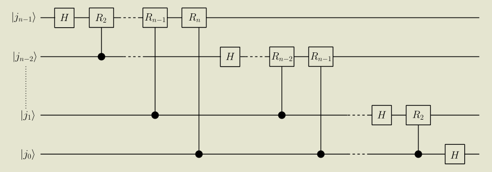

- ## Deutsch Josa #card
  card-last-interval:: 67.2
  card-repeats:: 3
  card-ease-factor:: 2.8
  card-next-schedule:: 2023-05-10T04:42:23.250Z
  card-last-reviewed:: 2023-03-04T00:42:23.251Z
  card-last-score:: 5
	- Problem
		- We have a function $f:\{0,1\}^n \rightarrow\{0,1\}$, which is promised to be constant or balanced.
		  We wish to find which it is the case.
		- Realized as a quantum gate $|x\rang |y\oplus f(x)\rang$
	- Idea
		- $|+\rang$ allow us to evaluate multiple values simultaneously, while $|-\rang$ flips the sign if the result is 1.
	-
	- Algorithm
		- Prepare input $|x_{in}\rang=\otimes^n|+\rang$, $|y_{in}\rang=|-\rang$
			- x is the equal superposition of all possible elements of $\{0,1\}^n$, while y is the 'testing bit'.
		- Apply f.
			- The trick appears again: ((63bab430-6e29-491b-9ae5-d02bed06e35d))
		- Use Hadamard to go back to the computational basis and measure the output.
		- If f is balanced, precisely half the states would acquire a **minus**, thus **orthogonal** with $\otimes^n|+\rang$
	-
	- Note: In general, there are $2^{2^n}$ possible functions, while only $2^n$-dimensional space. So we **can't** obtain 'which function it is' precisely.
	  However, it is possible to divide them into $2^n$ classes.
- ## Quantum Search #card
  card-last-interval:: 25.01
  card-repeats:: 1
  card-ease-factor:: 2.6
  card-next-schedule:: 2023-02-06T00:26:10.168Z
  card-last-reviewed:: 2023-01-12T00:26:10.169Z
  card-last-score:: 5
	- Problem
		- We have a function $f:\{0,1\}^n \rightarrow\{0,1\}$, $$f(x)= \begin{cases}1 & \text { if } x=x_0 \\ 0 & \text { otherwise }\end{cases}$$
		  We want to find $x_0$.
	- Idea
		- Similar to Deutsch-Josa. Exploit superposition properties.
	-
	- Grover's Algorithm
		- Prepare input $|x_{in}\rang=\otimes^n|+\rang=\frac{1}{\sqrt{2^n}} \sum_{x=0}^{2^n-1}|x\rangle$, $|y_{in}\rang=|-\rang$
		- Apply f.
		- Apply $D_{i j}=-\delta_{i j}+\frac{2}{2^n}$.
		- Repeat 2 and 3 several times until we obtain the desired precision.
		-
		- Note that the state at a certain step is $a|x_0\rang+b\sum_{others}|k\rang$.
			- After $O$ (apply f) it becomes $-a|x_0\rang+b\sum_{others}|k\rang$,
			- After $D$ it becomes $[a(1-\frac 2 {2^n})+\frac 2 {2^n}(2^n-1)b]|x_0\rang+[(-1+\frac 2 {2^n}(2^n-1))b-\frac 2 {2^n}a]\sum_{others}|k\rang$.
		- If b isn't too small, b always decreases and a always increases.
		-
		- Geometrically:
			- $O=I-2\left|x_0\right\rangle\left\langle x_0\right| \equiv R_{|x_0\rangle}$ (Note that the auxiliary bit is $|-\rangle$)
			- $D=H^{\otimes n}(-I+2|0\rangle\langle 0|) H^{\otimes n}=-(I-2|S\rangle\langle S|) \equiv-R_{|S\rangle}$, where $|S\rangle \equiv H^{\otimes n}|0\rangle=\frac{1}{\sqrt{2^n}} \sum_{x=0}^{2^n-1}|x\rangle$.
			- So $G:=DO=-R_{|S\rangle}R_{|x_0\rangle}=iR_{|S\rangle}R_{|x_0\rangle}$, i is the point reflection.
		- Since the initial state is in the plane spanned by $|0\rangle$ and $|S\rangle$ and all operations pre**serve the plane, we only need to consider the plane.**
		- It's easy to prove that $iR_{|S\rangle}R_{|0\rangle}$ is a combination of reflections, thus **a rotation of** $2\theta$, where $\theta$ is the angle between $|0\rangle$ and $|S^{\perp}\rangle$.
		- When n is very large, $\lang S|0\rangle=\frac 1 {\sqrt N}<<1$, so $\theta\sim\frac 1 {\sqrt N}$ is very close to zero. 
		  Thus we rotate a bit each step and get very close to $|0\rangle$ after $m\sim \sqrt N$ steps.
- ## Quantum Fourier Transformation
	- Def #card
	  card-last-interval:: 24
	  card-repeats:: 1
	  card-ease-factor:: 2.6
	  card-next-schedule:: 2023-03-22T01:18:33.567Z
	  card-last-reviewed:: 2023-02-26T01:18:33.568Z
	  card-last-score:: 5
		- Discrete [[Fourier Transformation]]
			- $\tilde{f}(k):=\frac{1}{\sqrt{N } } \sum_{j=0}^{N-1} e^{2 \pi i \frac{j k}{N}} f(j)$
		- Quantum Fourier Transformation
			- $$F(|j\rangle)=\frac{1}{\sqrt{2^n}} \sum_{k=0}^{2^n-1} e^{2 \pi i \frac{j k}{2^n}}|k\rangle$$
			- Note it is the behavior on a basis vector.
	- Circuit #card
	  card-last-interval:: 24
	  card-repeats:: 2
	  card-ease-factor:: 2.7
	  card-next-schedule:: 2023-03-27T00:31:34.082Z
	  card-last-reviewed:: 2023-03-03T00:31:34.082Z
	  card-last-score:: 5
		- Key: The gate is nonentangling, thus can be viewed as 'adding controlled phases $2 \pi  \frac{j k}{2^n}$ to the final qubits'
			- Moreover, only $m+n<N$ has nontrivial contribution to the phase. Others are multiples or $2\pi$, thus trivial.
		- $$
		  \begin{aligned}
		  F(|j\rangle) & =\frac{1}{\sqrt{2^n}} \sum_{k=0}^{2^n-1} \exp \left(\frac{2 \pi i j k}{2^n}\right)|k\rangle \\
		  & =\frac{1}{\sqrt{2^n}} \sum_{k_{n-1}=0}^1 \ldots \sum_{k_0=0}^1 \exp \left(2 \pi i j \sum_{l=1}^n \frac{k_{n-l}}{2^l}\right)\left|k_{n-1} \ldots k_0\right\rangle \\
		  & =\frac{1}{\sqrt{2^n}} \sum_{k_{n-1}=0}^1 \ldots \sum_{k_0=0}^1 \otimes_{l=1}^n \exp \left(2 \pi i j \frac{k_{n-l}}{2^l}\right)\left|k_{n-l}\right\rangle \quad \text{(Separate the final qubits}\\
		  & =\frac{1}{\sqrt{2^n}} \otimes_{l=1}^n\left[\sum_{k_{n-l}=0}^1 \exp \left(2 \pi i j \frac{k_{n-l}}{2^l}\right)\left|k_{n-l}\right\rangle\right] \\
		  & =\frac{1}{\sqrt{2^n}} \otimes_{l=1}^n\left[|0\rangle+\exp \left(2 \pi i j \frac{1}{2^l}\right)|1\rangle\right] \\
		  & =\frac{1}{\sqrt{2^n}}\left(|0\rangle+e^{2 \pi i 0 . j_0}|1\rangle\right)\left(|0\rangle+e^{2 \pi i 0 . j_1 j_0}|1\rangle\right) \cdots\left(|0\rangle+e^{2 \pi i 0 . j_{n-1} j_{n-2} \ldots j_0}|1\rangle\right) .
		  \end{aligned}
		  $$
		- 
			- Hadamard gates add a phase of $\pi$ if the qubit is 1. Corresponding to the first digit after the decimal point.
		- Efficiency: $\Theta\left(n^2\right)$
	-
	- ### Application: Period Finding
		- Problem (simplified version): We have a function $f:\{0,1\}^n \rightarrow\{0,1\}^m$ with period r such that $N/r=m \in Z$.
		  Moreover, $f(x)=f(y) \iff r|(x-y)$.
		  We wish to find r.
		- Idea: [[Quantum Fourier Transformation]] is a perfect tool to interfere phases.
		- Algorithm #card
		  id:: f8507a4e-f0a6-4134-af3a-8d602a276de1
		  card-last-interval:: 24
		  card-repeats:: 1
		  card-ease-factor:: 2.36
		  card-next-schedule:: 2023-04-02T00:43:36.489Z
		  card-last-reviewed:: 2023-03-09T00:43:36.491Z
		  card-last-score:: 3
			- Prepare input state $\frac{1}{\sqrt{2^n}} \sum_{x=0}^{2^n-1}|x\rangle|f(x)\rangle$
			- **Measure** the second register and obtain some $x_0$. The state collapses into $\frac{1}{\sqrt{m}} \sum_{j=0}^{m-1}\left|x_0+j r\right\rangle\left|f\left(x_0\right)\right\rangle$.
				- Project the superposed state to something pure! #Strategy
			- Perform QFT to the first register. $$\frac{1}{\sqrt{m}} \sum_{j=0}^{m-1} \frac{1}{\sqrt{2^n}} \sum_{k=0}^{2^n-1} e^{i2 \pi \left(x_0+j r\right) k / 2^n}|k\rangle=\frac{1}{\sqrt{m 2^n}} \sum_{k=0}^{2^n-1} e^{i2 \pi  x_0 k / 2^n} \sum_{j=0}^{m-1} e^{\color{yellow}{i2 \pi  j r k / 2^n}}|k\rangle$$
			  Only when $rk/2^n\in Z$ can we obtain a nonzero coefficient. That is, $k=N\frac tr, t\in Z$
			-
			- Measure k and obtain some $k=\frac p q N,(p,q)=1$. 
			  Perform the process several times and find $$lcm(q_1,...,q_w)$$ which is quite likely to be r.
	- ### Shor's Algorithm #card
	  card-last-interval:: 24
	  card-repeats:: 2
	  card-ease-factor:: 2.7
	  card-next-schedule:: 2023-03-13T01:01:57.336Z
	  card-last-reviewed:: 2023-02-17T01:01:57.336Z
	  card-last-score:: 5
		- Problem
			- Factor a given number.
		- Idea
			- 'Factoring' can be reduced to 'finding the **period**'.
			- Moreover, gcd can be **efficiently** done by classical computers.
		- Prop. If $(x,N)=1$, there exists some r s.t. $x^r=1\ mod \ N$.
		  The smallest r is defined as the **order** of x.
		-
		- Prop. If $x^{2r}=1\ mod \ N$ and $x^r\neq \pm1\ mod \ N$,
		  Then one of $gcd(x^r-1,N)$ and $gcd(x^r+1,N)$ must be nontrivial.
		-
		- Algorithm
			- Pick random $x\in\{2,3,...,N-1\}$ s.t. $gcd(x,N)=1$. This condition is to ensure that r **exists**.
			- Quantumly find the period $r$ of $x$. If r is odd then pick x again.
				- Note that $N$, the number to be factored, is the number to be moduled (not to be powered).
			- Now r is even. Calculate $gcd(x^r-1,N)$ and $gcd(x^r+1,N)$ to find nontrivial factors.
			  The only failing case is that $N|(x^r+1)$
		-
		-