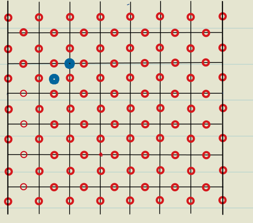
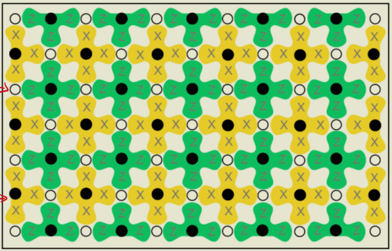
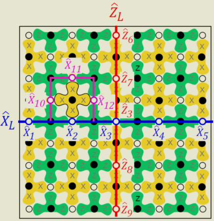

- We can't do quantum computation on the ground space of [[Toric Code]].
	- The logical operators aren't universal, only $X$ and $Z$. Moreover, the two qubits aren't coupled.
- Excited states are even more hopeless, since there are only abelian anyons.
-
- Try to use a plane instead of the torus
	- Case1. Pure smooth boundaries
		- The solution process is similar. $A_v$ forces close loops, $B_p$ generate path homotopies.
		- GSD=1.
		  background-color:: red
		  Nothing nontrivial will happen.
	- Alternating boundaries #[[To be recorded]]
		- Defs
			- Quiescent state
				- A 'pure' logical state, i.e. Same eigenvalue to all stabilizers.
				- Note that the quiescent state can be the eigenstate of all A and B with eigenvalue either $+1$ or $-1$.
		- {:height 458, :width 512}
			- Note there are no $A_v$ on the rough boundary.
		- Ground states #card
		  card-last-interval:: 67.2
		  card-repeats:: 3
		  card-ease-factor:: 2.8
		  card-next-schedule:: 2023-06-07T05:06:16.502Z
		  card-last-reviewed:: 2023-04-01T01:06:16.503Z
		  card-last-score:: 5
			- Details in Onenote.
			- GSD
				- Number of spins = $n(n+1)+n(n-1)=2n^2$
				- Number of A = $(n-1)(n+1)=n^2-1$
				- Number of B =$n\cdot n=n^2$
				- d.o.f. = 1
				- **GSD = 2**
					- 1 qubit!
			- Exact rep. of ground states
				- Still, A force close loops and B generate homotopic loops.
				- One ground state is the trivial homotopy class; the other is connecting two rough boundaries.
		- Note: $|\psi\rangle=|q\rangle_L \otimes|\alpha\rangle$, where q is a logical state and $\alpha$ denotes the part of the stabilizers.
		- Comment: Alternating boundaries -> Extra qubits
		  collapsed:: true
			- Exercise. What happens when we add back a spin to the middle of the rough boundary? #card
			  card-last-interval:: 24
			  card-repeats:: 2
			  card-ease-factor:: 2.7
			  card-next-schedule:: 2023-03-21T00:09:34.992Z
			  card-last-reviewed:: 2023-02-25T00:09:34.992Z
			  card-last-score:: 5
				- One more spin.
				- No more constraints. (The vertices of the spin aren't counted.)
				- **Conclusion: One more degree of freedom.**
					- Alternating boundaries lead to qubits!
		- Error correction
			- Generally we correct errors by measuring the stabilizers. In this case they are $A_s$ and $B_p$.
			- Visualize:
			   
				- The black dots represent the data to be measured.
			-
		- Logical operators
			- Logical Z -> Any Z string connecting the rough boundaries
			- Logical X -> Any X string connecting the smooth boundaries
			- Example
				- 
		-