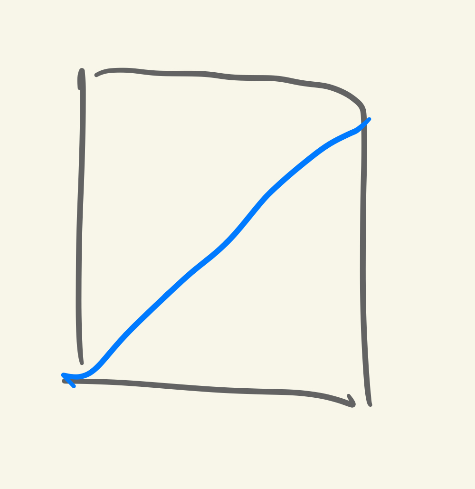
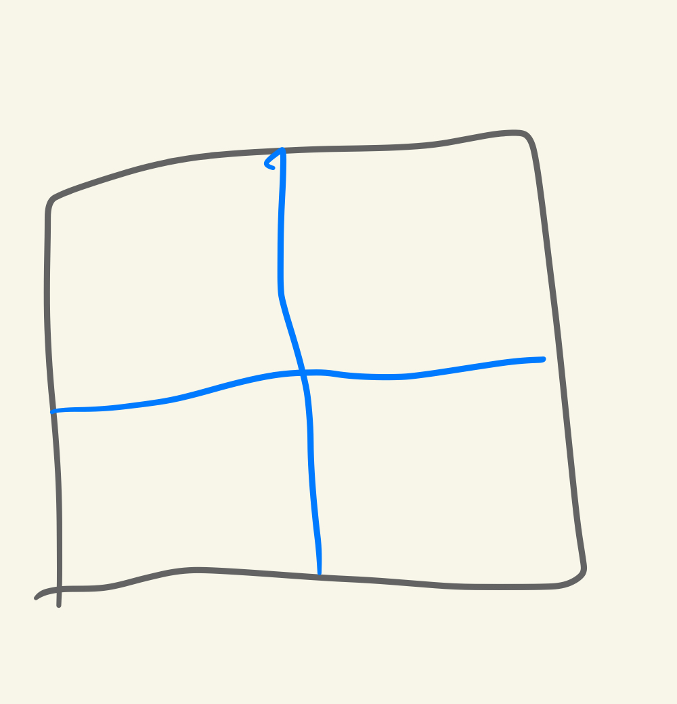

alias:: TEE

- Refs
	- ((64c7f96e-ae1a-4947-addd-5c6e272b298b))
	- [topological entanglement entropy -- references in nLab (ncatlab.org)](https://ncatlab.org/nlab/show/topological+entanglement+entropy+--+references)
	  id:: 63b186e1-f6f5-490b-bd72-02d54b1b0af9
		- Include 2 main papers on [[Topological Entanglement Entropy]]
		- Related paper: 
			- Seems quite interesting.
- # Examples
	- TEE and MES in [[Toric Code]] #card
	  card-last-score:: 5
	  card-repeats:: 1
	  card-next-schedule:: 2023-04-27T01:15:26.451Z
	  card-last-interval:: 25.01
	  id:: 6498e102-7d82-4736-8535-b3d2e3043a31
	  card-ease-factor:: 2.6
	  card-last-reviewed:: 2023-04-02T01:15:26.451Z
		- ((63f9ab7a-5493-4741-8119-f9751148f6a8))
		- The key is that we can find a **clever basis** for states in region B, 
		  collapsed:: true
		  i.e. the basis corresponding to boundary configurations.
			- Another sort of [[Bulk-Boundary Correspondence]].
			- Note that the picture is precise when the state is written as a Schmidt decomposition, which requires each 'component' in both subsystem to be orthonormal.
			-
			- Good properties of the basis
				- A state uniquely corresponds to a boundary configuration
				- All boundary configurations have the same weight
				- *Could be explicitly written easily by loops
			-
		- ## Contractible Bipartition
		  collapsed:: true
			- Now we calculate TEE of a certain **ground state**.
			  collapsed:: true
				- That is, we can fix a homotopy class.
				- Do so for excited states. [[Research/To Be Investigated]]
			- We need to decompose the ground state into $|\psi\rangle:=\sum c_i \cdot\left|\psi_{A i}\right\rangle \cdot|\alpha\rangle \cdot\left|\psi_{B i}\right\rangle$
				- The three terms corresponds to A, boundary and B.
				- In principle all configs in B have independent contributions to the reduced density matrix of A. But we may take $\psi_B$ to be a superposition state.
			- **Observations**
				- Allowed configurations inside a region is only dependent on the boundary config, not on the config of the other region.
				- Inside a region, each action of $B_p$ would create a new valid config (from the reference config). Moreover, they're all independent.
					- Therefore the weights of all boundary configs are equal!
				- Different boundary configs always generate independent configs in A and B.
			- Therefore, we only need to count the allowed boundary configs. They're all of equal weight.
			  collapsed:: true
				- We must have an even number of blue strings crossing the boundary.
				- $N=\sum_{k}C_{L}^{2k}$, where L is the length of the boundary.
				- By some combinatoric, we obtain $N=2^{L-1}$.
		- Result:
		  collapsed:: true
		  $$S=(L-1)\ln 2$$
			- The constant term $-\ln2$ is related to the quantum dimension of TC.
			- It is worth noting that if region $A$ has two boundaries as in Fig. $33.4$ we will get instead
			  $$
			  \mathcal{S}_{A, B}=(M-2) \log 2
			  $$
				- In other words, each piece of boundary adds a constraint.
				- Could we investigate other topologically nontrivial boundaries? #Possibility
					- Moreover, we may investigate higher dimensional topo orders with higher dimensional boundaries.
					- Reminiscent of [[Homology]] :)
		- ## Non-Contractible Bipartition
		  collapsed:: true
			- Consider partitioning a torus into two cylinders (denoted A and B) in the x direction, with left and right boundaries.
			- Restrictions
				- $n_L=n_R :=n$
				- When the x sector is trivial, $n$ must be even; otherwise $n$ could be odd.
					- The effect is that only half the config is allowed in a pure sector.
				- The total number of y loops must be equal to the y sector.
					- Therefore the configs in A and B actually depend on each other!
			- Calculation
				- Note that the key is to find a convenient Schmidt decomposition, which greatly simplifies the partial trace.
				-
				- Number of boundary string configs
					- $$\# n = \frac {(1+1)^L \pm (1-1)^L}{2}=2^{L-1}$$
						- Note that $\pm$ corresponds to the respective cases that $n$ must be even or odd.
						- $L$ is half the length of the boundary.
				-
				- Now lets fix the boundary string config and count the number of possible bulk configs, i.e. find the Schmidt decomposition.
					- Key point: Each boundary config corresponds to two sets of Schmidt decompositions, i.e. we can obtain another sets by adding a loop to both regions.
					- Therefore the number of configs is $2 \times \#n =2^L$.
				- The TEE vanishes?
				  background-color:: red
				-
				-
		-
		- ## Superposition of degenerate ground states
			- #+BEGIN_NOTE
			  The ground states of well-defined flux should be superposition of homotopy classes, similar to the projectors in [[Tube Algebra]] .
			  #+END_NOTE
			- For convenience, we first consider the superposition of two degenerate ground states,
			  $$|\psi\rangle = c_1 |\phi_1\rangle + c_2 |\phi_2 \rangle$$
			-
			- Contractible bipartition
			  collapsed:: true
				- Theorem. The superposition doesn't affect TEE.
				- Proof
					- Suppose A is a bounded contractible region and B is unbounded.
					- First consider a pure ground state, which can be decomposed as 
					  $$|\psi\rangle=\frac 1 N \sum_i |\phi^A_i \rangle \otimes |\phi^{\partial A}_i \rangle \otimes |\phi^B_i \rangle$$
						- The observation is that $|\phi^A_i \rangle$ and $|\phi^B_i \rangle$ are completely determined by the boundary state. Moreover they are orthogonal.
					- A superposition of ground states could be written as
					  $$|\psi\rangle=\frac 1 N \sum_i |\phi^A_i \rangle \otimes |\phi^{\partial A}_i \rangle \otimes (c_1|\phi^B_i \rangle + c_2 \hat L|\phi^B_i \rangle)$$
						- $\hat L$ is a nontrivial loop operator.
					- Note that it is still a legitimate Schmidt decomposition (two sets are respectively orthogonal) and the coefficients don't change.
					-
			- Non-contractible bipartition
				- This case is different and more interesting. Let's examine the example of TC in more detail.
				- Setup
					- Select the basis to be 4 homotopy classes of loops.
					- Consider a nontrivial bipartition of the torus into two cylinders in the x direction.
				-
				- Proposition. Superposition of different y homotopy classes increases the entanglement entropy.
					- Boundary states corresponding to different y fluxes are orthogonal and the Schmidt decompositions are also orthogonal.
					- Therefore, superposition of y fluxes merely adds more Schmidt components.
				- Proposition. Superposition of different x homotopy classes could decrease the entanglement entropy.
					- In the trivial homotopy class, the ground state could be written as
					  $$|\psi \rangle =\frac{1}{N}\sum _{i} |\phi _{i,e}^{A} \rangle \otimes |\phi _{i}^{\partial A} \rangle \otimes |\phi _{i,e}^{B} \rangle $$
					- After a superposition with nontrivial y homotopy, the new state is
					  $$|\psi \rangle =\frac{1}{N}\sum _{i}\left\{|\phi _{i,e}^{A} \rangle \otimes |\phi _{i}^{\partial A} \rangle \otimes \left( c_{1} |\phi _{i,e}^{B} \rangle +c_{2} |\phi _{i,o}^{B} \rangle \right) +|\phi _{i,o}^{A} \rangle \otimes |\phi _{i}^{\partial A} \rangle \otimes \left( c_{2} |\phi _{i,e}^{B} \rangle +c_{1} |\phi _{i,o}^{B} \rangle \right)\right\}$$
					- Tracing out the A part, the reduced density matrix $\rho_B$ is still block diagonalized wrt the boundary states. 
					  The block writes
					  $$\rho _{B} =\frac{1}{N^{2}}\begin{bmatrix}
					  1 & c_{1} c_{2}^{*} +c_{1}^{*} c_{2}\\
					  c_{1} c_{2}^{*} +c_{1}^{*} c_{2} & 1
					  \end{bmatrix}$$
					- Since $|c_1|^2+|c_2|^2=1$, we have
					  $$-1 \leq c_{1} c_{2}^{*} +c_{1}^{*} c_{2} =2 \operatorname{Re} (c_1 c_2^*)\leq 1$$
					- Denoting $a=2 \operatorname{Re} (c_1 c_2^*)$, the two eigenvalues are
					  $$\lambda_1 = \frac 1 {N^2} (1+a), \quad \lambda_2 = \frac 1 {N^2} (1-a)$$
					- A quick calculation shows that EE in the block is smallest when $a=\pm 1$ and largest when $a=0$.
	- TEE and MES in [[Double Semion Model]]
	  collapsed:: true
		- The calculation of TEE of a pure homotopy class is similar to the toric code.
			- We still perform Schmidt decomposition according to the boundary configuration. Still all components are of equal weight.
			- The different is the sign structure of the components, which is not significant in calculating TEE.
		- MES is more interesting.
		  collapsed:: true
			- Setup
				- Select the basis to be 4 homotopy classes of loops.
					- Note that the $(1,1)$ basis vector should be chosen to be {:height 99, :width 85}
					- {:height 107, :width 88} is ambiguous since different ways of reconnection differ by $-1$.
					-
				- Consider a nontrivial bipartition of the torus into two cylinders in the x direction.
			-
			- Proposition. Superposition of different y homotopy classes increases the entanglement entropy.
				- Boundary states corresponding to different y fluxes are orthogonal and the Schmidt decompositions are also orthogonal.
				- Therefore, superposition of y fluxes merely adds more Schmidt components.
			- Proposition. Superposition of different x homotopy classes could decrease the entanglement entropy.
				- In the trivial homotopy class, the ground state could be written as
				  $$|\psi \rangle =\frac{1}{N}\sum _{i} |\phi _{i,e}^{A} \rangle \otimes |\phi _{i}^{\partial A} \rangle \otimes |\phi _{i,e}^{B} \rangle $$
				- After a superposition with nontrivial y homotopy, the new state is
				  $$|\psi \rangle =\frac{1}{N}\sum _{i}\left\{|\phi _{i,e}^{A} \rangle \otimes |\phi _{i}^{\partial A} \rangle \otimes \left( c_{1} |\phi _{i,e}^{B} \rangle +c_{2} |\phi _{i,o}^{B} \rangle \right) +|\phi _{i,o}^{A} \rangle \otimes |\phi _{i}^{\partial A} \rangle \otimes \left( c_{2} |\phi _{i,e}^{B} \rangle - c_{1} |\phi _{i,o}^{B} \rangle \right)\right\}$$
					- Everything subtle is contained in the last minus sign before $c_1$!
				- Tracing out the A part, the reduced density matrix $\rho_B$ is still block diagonalized wrt the boundary states. 
				  The block writes
				  $$\rho _{B} =\frac{1}{N^{2}}\begin{bmatrix}
				  1 & c_{1} c_{2}^{*} - c_{1}^{*} c_{2}\\
				  -c_{1} c_{2}^{*} +c_{1}^{*} c_{2} & 1
				  \end{bmatrix}$$
				- Since $|c_1|^2+|c_2|^2=1$, we have
				  $$-1 \leq c_{1} c_{2}^{*} +c_{1}^{*} c_{2} =2 \operatorname{Im} (c_1 c_2^*)\leq 1$$
				- Denoting $b=2 \operatorname{Im} (c_1 c_2^*)$, the two eigenvalues are
				  $$\lambda_1 = \frac 1 {N^2} (1+b), \quad \lambda_2 = \frac 1 {N^2} (1-b)$$
				- A quick calculation shows that EE in the block is smallest when $b=\pm 1$ and largest when $b=0$.
				-
				- Therefore, the MES configurations are
				  $$c_1 =\frac 1 {\sqrt 2}, c_2=\frac i {\sqrt 2}$$
				  and
				  $$c_1 =\frac 1 {\sqrt 2}, c_2=-\frac i {\sqrt 2}$$
				-
	- Comment: Difference between MES of TC and double semion
	  collapsed:: true
		- $$|\psi_{TC} \rangle =\frac{1}{N}\sum _{i}\left\{|\phi _{i,e}^{A} \rangle \otimes |\phi _{i}^{\partial A} \rangle \otimes \left( c_{1} |\phi _{i,e}^{B} \rangle +c_{2} |\phi _{i,o}^{B} \rangle \right) +|\phi _{i,o}^{A} \rangle \otimes |\phi _{i}^{\partial A} \rangle \otimes \left( c_{2} |\phi _{i,e}^{B} \rangle + c_{1} |\phi _{i,o}^{B} \rangle \right)\right\}$$
		- $$|\psi_{DS} \rangle =\frac{1}{N}\sum _{i}\left\{|\phi _{i,e}^{A} \rangle \otimes |\phi _{i}^{\partial A} \rangle \otimes \left( c_{1} |\phi _{i,e}^{B} \rangle +c_{2} |\phi _{i,o}^{B} \rangle \right) +|\phi _{i,o}^{A} \rangle \otimes |\phi _{i}^{\partial A} \rangle \otimes \left( c_{2} |\phi _{i,e}^{B} \rangle - c_{1} |\phi _{i,o}^{B} \rangle \right)\right\}$$
		- Note that the relative minus sign is robust against multiplying additional phases in front of the basis elements.
			- For example, we can also write
			  $$|\psi_{DS} \rangle =\frac{1}{N}\sum _{i}\left\{|\phi _{i,e}^{A} \rangle \otimes |\phi _{i}^{\partial A} \rangle \otimes \left( c_{1} |\phi _{i,e}^{B} \rangle -c_{2} |\phi _{i,o}^{B} \rangle \right) +|\phi _{i,o}^{A} \rangle \otimes |\phi _{i}^{\partial A} \rangle \otimes \left( c_{2} |\phi _{i,e}^{B} \rangle + c_{1} |\phi _{i,o}^{B} \rangle \right)\right\}$$
			  which amounts to multiplying $-1$ to $|\phi _{i,o}^{B} \rangle$.
			-
			-