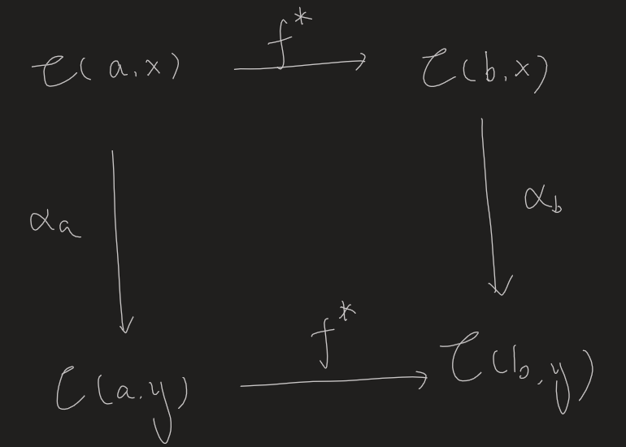

- ((6416cac5-4bfa-43d5-bedc-223b9ff5e0da))
- Statement #card
	-
	- For any functor $F: \mathrm{C} \rightarrow$ Set, whose domain $\mathrm{C}$ is locally small and any object $c \in \mathrm{C}$, there is a canonical bijection
	  $$
	  \operatorname{Nat}(\mathrm{Hom}_\mathrm{C}(c,-), F) \cong F (c)
	  $$
	  Moreover, this correspondence is natural in both $c$ and $F$.
	- It also tells us that if $F(c_1)$ is not isomorphic to $F(c_2)$, then the functors represented by $c_1$ and $c_2$ must be inequivalent.
- Proof #card
	- We should explicitly construct the correspondence, then verify it is both injective and surjective.
		- Denote it by $J:\operatorname{Nat}(\mathrm{Hom}_\mathrm{C}(c,-), F) \to F c$.
	- There is only one canonical choice: Consider $\mathrm{Hom}_{\mathcal{C}}(c,c)$ and $id_c$. Define $J(\alpha)=\alpha_c(id_c)$.
	- Injectivity
		- Verify that $\alpha_x$ as a map from $\mathrm{Hom}_{\mathcal{C}}(c,x)$ to $F(x)$ is already fixed by $\alpha_c(id_c)$.
			- Remark: Naturality is so strong a condition that everything else is fixed by the simple knowledge of $\alpha_c$ on a **single** element $id_c$.
	- Surjectivity
		- $\alpha_x$ can be constructed as above. What remains is to verify that it is indeed a natural transformation.
		- It follows by the functoriality of $F$.
- # Corollaries
	- $$
	  \operatorname{Nat}(\mathrm{Hom}_\mathcal{C}(c,-), \mathrm{Hom}_{\mathcal{C}}(d,-)) \cong \mathrm{Hom}_{\mathcal{C}}(d,c)
	  $$ #card
		- In plain English, 'natural transformations between two representable functors' is canonically bijective to 'the hom set between the representative elements'.
		- Also this means that $F:C\to \mathrm{Fun}(\mathcal C,\mathrm{Set}), x\mapsto \mathrm{Hom}_{\mathcal{C}}(x,-)$ is really an imbedding since it is fully faithful.
		  It is called the **Yoneda imbedding**
	- If there is a natural isomorphism between $\mathrm{Hom}_{\mathcal{C}}(-,x)$ and $\mathrm{Hom}_{\mathcal{C}}(-,y)$, then $x \simeq y$. #card
	  card-last-interval:: 30
	  card-repeats:: 1
	  card-ease-factor:: 2.36
	  card-next-schedule:: 2023-05-13T01:41:29.972Z
	  card-last-reviewed:: 2023-04-13T01:41:29.973Z
	  card-last-score:: 3
		- First note that the Yoneda imbedding, $F:C\to \mathrm{Fun}(\mathcal C,\mathrm{Set}), x\mapsto \mathrm{Hom}_{\mathcal{C}}(x,-)$, is a functor.
		- Moreover it is fully faithful.
		- Therefore, if we have a natural isomorphism (which is an isomorphism in the cat $\mathrm{Fun}(\mathcal{C},\mathrm{Set}))$, we must be able to find an isomorphism as its preimage.
		-
		- Stupid way
			- {:height 423, :width 567}
			- Take $a=x,b=y$ and $a=y,b=x$.
			- Consider the maps $\alpha_a(\mathrm{id}_a)$ and $\alpha_a^{-1}(\mathrm{id}_a)$
	- An adjoint functor $G$ of some $F$ is unique up to an unique isomorphism. #card
	  card-last-interval:: 24
	  card-repeats:: 1
	  card-ease-factor:: 2.36
	  card-next-schedule:: 2023-04-24T11:48:41.768Z
	  card-last-reviewed:: 2023-03-31T11:48:41.770Z
	  card-last-score:: 3
		- It is easier from the second version of the ((6416c1f0-2caa-46a8-85c7-b247488d0785)). (Exercise)
		- From the first definition:
			- Suppose $G_1$ and $G_2$ are both adjoint functors.
			- Since $\mathrm{Hom}_{\mathcal{C}}((-),G(-)) \simeq \mathrm{Hom}_{\mathcal{D}}(F(-),(-))$, we can fix some d to obtain $\mathrm{Hom}_{\mathcal{C}}((-),G_1(d)) \simeq \mathrm{Hom}_{\mathcal{D}}(F(-),(d)) \simeq \mathrm{Hom}_{\mathcal{C}}((-),G_2(d))$
			- By Yoneda embedding, $\mathrm{Hom}_{\mathcal{C}}((-),G_1(d)) \simeq \mathrm{Hom}_{\mathcal{C}}((-),G_2(d))$ means that $G_1(d)\simeq G_2(d)$.
			- Moreover, the isomorphism is natural.
				- It can be proven by the naturality $\mathrm{Hom}_{\mathcal{C}}((-),G(-)) \simeq \mathrm{Hom}_{\mathcal{D}}(F(-),(-))$ in **both** components.
				-
			-